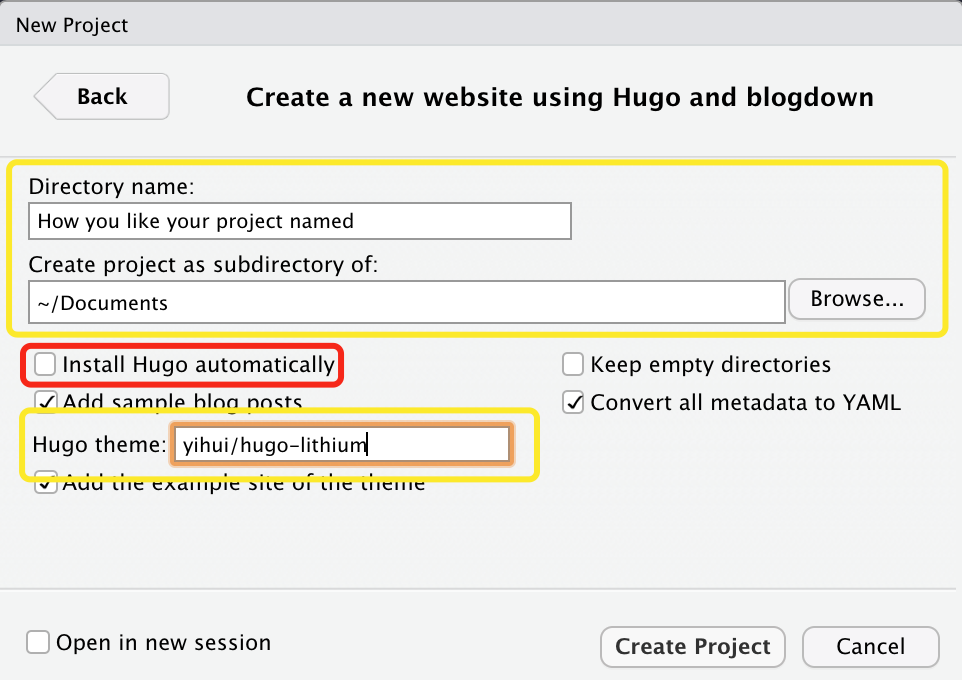

## Why do you need a personal website?

Before I started building my own personal website, I wondered the same question. Now that the mobile Internet is booming in 2020, you may ask, what purpose does a personal "blog" serve when people can quickly post and gather information via Weibo, WeChat, Facebook, Twitter, and so on? It's true that social media software has made our lives a lot easier, but you may have noticed, as I have, that when we need to google some high-quality material, there' s a good chance that the content will be on a personal website. I think the great thing about having a personal website is that it's not only a window to showcase your abilities, but it's also a tool to continually improve your skills. Every time you solve a problem with google, you can record the solution on your personal website and avoid spending time looking it up again the next time you encounter the same problem. For those of you who are eager to improve, writing articles can be of great help because you will start to benefit from the moment you start writing.

## Workflow in One Sentence

The tools I used in this guide are R blogdown, based on R Language, and HUGO, a static website generator, and I stored my files via GitHub and finally deployed the site to the Internet using Netlify's free service.

#### Pros：

- It's FREE！
- Fast Respond.
- You don't have to build a data base when you store everything through GitHub.
- Edit and publish articles directly in R Studio
- .Rmd file support, rendering plots and tables, highlighting R code.

## First Thing First — GitHub

### Get a GitHub Account

You can click [here](https://github.com/) to GitHub's main page, 


Click on *Sign Up* to create yourself a GitHub account. 

### **Log in to your account and let's start our journey from here.**

In your home page, you can create a ***New Repository.*** 

 

Check this picture, there are several things worthy to be noticed. 

1. You can name your repo anything you want, it doesn't need to be unique, because it won't be the last domain name of your website.
2. You can add some descriptions to your repo, mainly to remind you of its use in the future.
3. Always remember to check the Add .gitignore box, and select template for R, to prevent you from accidentally uploading an R log or data set to your site. ·oops·

### GitHub Desktop

Thank goodness GitHub has such an amazing tool that we don't have to spend time learning Git commands! I strongly recommend that you install this software.

 

You can easily link to the repo you just created, and browse or edit your content locally via a text editor or in your folder. When you're done, GitHub Desktop will automatically recognize your changes, and you can easily upload your new content to your GitHub page by simply stating the keywords you've changed in the entry box in the bottom left corner. (How convenient!)

## Second Step — R Blogdown

For those of you who already have R and R studio installed, skip to Configuring R Studio to continue reading.

### Start From R Language

The R language is one of the most popular software programs used by statisticians and data analysts. It's powerful, fast, simple, reliable, and multi-platform. You can learn more about it [here](https://www.r-project.org), and download the version that's right for you at [here](https://cran.r-project.org/mirrors.html).

### And The Wonderful R Studio

After you have installed R Language, you will need R Studio, a cross-platform IDE for R, to perform the next steps. You can download the appropriate version of R Studio for you at [here](https://rstudio.com/products/rstudio/download/).

### Configuring R Studio

After installing the above software, R Studio needs to be configured in a few simple steps: 

- Tools -> Global Options -> Sweave -> Weave Rnw files using:**knitr**


Tip: You can also select **XeLaTex** to generate a .pdf file if your file contains characters from other languages such as Chinese.

### Install Blogdown and Hugo

Blogdown is a package developed by Yihui, and we can install it as we would do to any other packages.

In the console, type in: 

```
install.packages('blogdown')
```

And then still in console, type in following code to install Hugo:

```
blogdown::install_hugo()
```

Now, you have got every thing to create your first Website! (/≧▽≦)/

## Your Local Website

### Let's Dig Deeper In Blogdown

Follow the procedure: File -> New Project -> New Directory -> Website using blogdown



- Here in the first box, you can personalize the project name, and its address.
- You don't have to check the red box, cause we have already installed Hugo. (Yay!)
- About the theme, we use the default Hugo theme created by Yihui. You can browse other's GitHub and find other theme you'd like.

#### About theme

- If you want to change the theme, there are many options [here](https://themes.gohugo.io/).
- You can go to the author's GitHub page and copy the repo dir like this: author_name/repo_name and paste it into the appropriate box in the previous step.

Please be aware, that you need to make sure that the theme you choose supports R Blogdown as well as LaTeX display, otherwise your images and formulas will not display properly.

Yihui puts it like this in the [blogdown](https://bookdown.org/yihui/blogdown/other-themes.html) documentation:

> Another thing to keep in mind is that the more effort you make in a complicated theme, the more difficult it is to switch to other themes in the future, because you may have customized a lot of things that are not straightforward to port to another theme.

### Now Run Your Local Website

Your website is able to be deployed locally on your computer, you can click **Addins** in R Studio, and then click **Serve Site** to take a preview. 


During the process, you may see some notes about install additional packages, just follow the instruction is fine. 

At last, you can see your Website under the **Viewer** tag. 🤟


### Make A New Post

You can click **Addins** in R Studio again, and then click **New Post** to make a new post. 


- The Filename section will be automatically filled in  as the Title you named.
- If you don't want to use the R code to calculate the graphs in the blog post, choose Markdown for the Format.
- You can view the file in the content folder.
- At this point, you can focus on writing in markdown format.

**Don't forget to push your changes to your GitHub repo before you move to the next step!**

## Finally, Deploy your Website Through Netlify

### Sign Up Netlify

You can make a Netlify account from here, click **Github** for next steps.


Follow the instructions to link your GitHub account.

### New Site Set Up


Click **Sites**, then **New site from Git**.


You can click **Github** and find your repo we just made in the first step.


You can set up like this.

### Hit the *Deploy site* Botton

Now you can see your website online! 

#### Before you go, give your website a unique domain name.

Go to your site's Netlify page, then click Domain management, and click Options to Edit your site's name. 

After that, you now have a personal website with a unique domain name. Congratulations!!! 

## Start today let the world knows about you!!!


