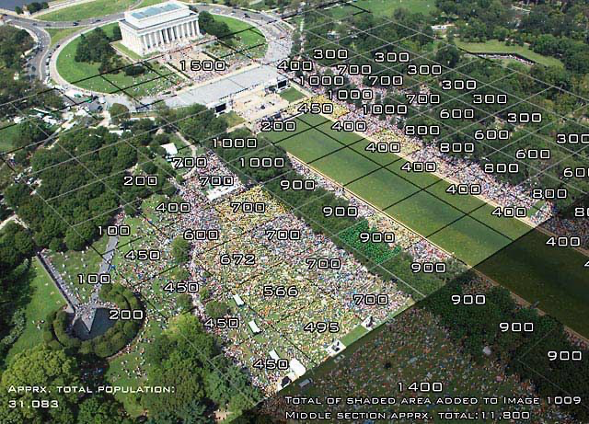
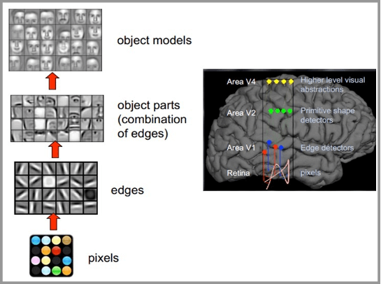
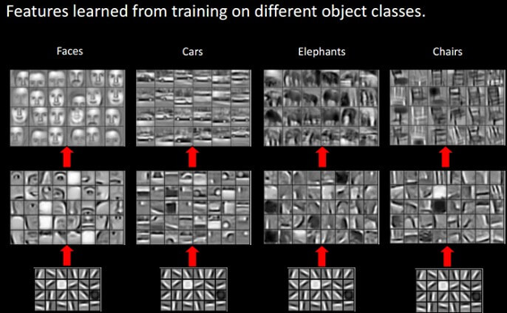
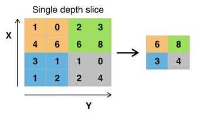
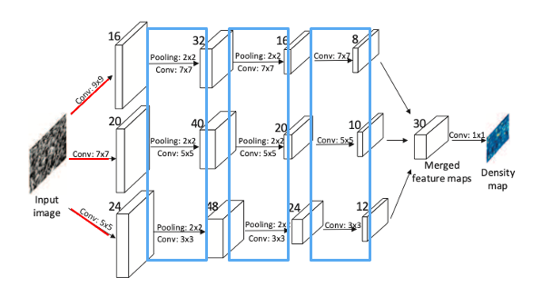
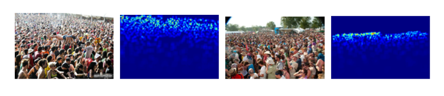

## INTRODUCTION

In public places such as public squares, bus stops, malls, shopping centers, et al., the statistics on the number of people are indispensable for their management and decision making. For example, these data can help retail managers to calculate their conversion rates. A retail store manager can count the customer footfall in different areas of the store. With this, they can know the peak times of customer visits and allocate employees to serve customers, thus creating further value in revenue, profit, and customer experience.

The crowd counting system is an AI-enabled intelligent system. It collects data and can provide actionable insights to its users. This technical document aims to describe how to use AI techniques to estimate crowd counts, focusing on the evolution of this technique from simple to involved and the more popular generic models currently available.

## TECHNICAL PRINCIPLES

### THE ORIGINAL JACOBS' METHOD

The most reliable way to count people is to count them manually. In real life, however, this primitive method is inefficient but practically inoperable since the population to be counted usually dynamic. In such cases, we must rely on our mathematical and reasoning abilities. 

In the 1960s, Herbert Jacobs, a professor at the University of California, Berkeley, developed a robust method for estimating crowds, which he used on campus to count the number of protesters against the Vietnam War. While observing the protesters gathered in the plaza below his office window, Jacobs realized that he could use the plaza's architectural features to estimate the crowd size. Jacobs first divided the plaza into grids of equal size according to the geometric texture of the ground. He accurately counted the number of people in several typical grids and multiplied the average size of the crowd of these grids by the total number of grids to get an estimated total number of people. This method dramatically reduces the time and effort involved in counting.  

However, like other estimation methods, the results obtained by this method are uncertain, since the whole process relies on many assumptions, each of which is accompanied by some uncertainty. Nevertheless, the beauty of mathematics and statistics is that we can estimate the size of the population and the quality of our estimates. This means that we can accurately calculate a range of crowd sizes, and that range is likely to include the actual number of people. 

*Figure 1, DDIS counts heads at Glenn Beck's rally at the Lincoln Memorial in August 2010.*
 
### MODERN IMPROVEMENTS OF JACOBS' METHOD

With advances in imaging technology, the Jacobs' method has been hugely improved. Today, researchers can launch balloons or drones, hover over events, and capture people's high-resolution images. The application of statistics has also significantly reduced the bias in operation. It is still mostly the Jacobs' method, which measures the average density of the area represented by a crowd and multiplies it by the total area over which the people are distributed. These technical improvements do not make counting crowds accurate enough.

### ARTIFICIAL INTELLIGENCE APPROACH OF CROWD COUNTING PROBLEM

Over the past few years, due to the publication of deep learning and challenging datasets, crowd size estimation from crowd images has evolved from early approaches limited by challenges such as occlusion, non-uniform density, and variations in scale and perspective of the scene, to a series of advanced approaches that can be successfully implemented in a variety of scenarios. Among them, Convolutional Neural Network (CNN) based approach is one of the most accurate and popular. 

### WHAT IS CONVOLUTIONAL NEURAL NETWORK (CNN)?

Convolutional neural network (CNN) is a class of deep neural networks that are commonly used to analyze visual images, and it uses relatively less preprocessing compared to other image classification algorithms.

**PRIOR TO THE ADVENT OF CNNS, IMAGES WERE A CHALLENGE FOR AI FOR TWO REASONS:**

1.	The amount of data that needs to be processed for the images is too large, resulting in high costs and inefficiencies.

2.	Difficulty in preserving original features during digitization of images, resulting in low accuracy of image processing.

**CNN METHODS HAVE TWO MAIN FEATURES:**

1.	Ability to effectively reduce a large amount of data of the image into a small amount of data. 

2.	Ability to effectively retain the characteristics of the image, in line with the principles of image processing

*Figure 2, The Principle of Human Vision: People take in pixels from the pupil, then process them to find the edges and directions. By recognizing the abstract shapes, the human brain makes abstract associations based on the shapes to determine what they see at last.*

*Figure 3, For different objects, the human brain recognizes substantially similar features at the underlying level. Finally, it combines the different features into corresponding images to distinguish between different objects accurately.*

By mimicking the principle of human vision, CNN reduces a large number of parameters to a small number of parameters by simplifying a complex problem and processing them.

### A TYPICAL CNN CONSISTS OF 3 PARTS:

1.	The Convolution layer, Uses a filter (convolution kernel) to filter the small areas of the image to get the eigenvalues of these small areas.

2.	The Pooling layer, reduces the data dimension more effectively than the convolutional layer and effectively avoid overfitting.

*Figure 4, A simplified example of using Max Pooling to downscale data in a convolutional layer. By dividing the matrix into four sections and choosing the maximum value in each section, we get a new matrix containing the main features of the large matrix. *

3.	The Fully Connected layer, is a simple Multilayer perceptron neural network (MLP) processes the data processed by the convolutional and pooling layers to get the final desired result.

After understanding the basic principles of CNN, let us focus on one of the actual application of CNN in crowd counting.

### SINGLE-IMAGE CROWD COUNTING VIA MULTI-COLUMN CONVOLUTIONAL NEURAL NETWORK (MCNN)

The MCNN method uses three columns of convolutional neural networks of different scales. Finally, the three convolutional neural network columns are merged to obtain the density map generated by the network. 

*Figure 5, Each of the three columns of convolutional neural networks is sampled in the order of convolution, pooling, pooling, and convolution. The convolutional kernels are used at multiple scales to adapt to different scales of human images.*

Once the density map is obtained, it can be turned into a more accurate population statistic by calculating the actual density of humans in each region and performing arithmetic problems using the Jacobs' method. The idea is the same, but the technique does provide more accurate results. 

*Figure 6, Example Density Plots of Crowd’s Pictures.*

## CONCLUSION 

Analyzing the number of people from images is a complex and challenging computer vision and artificial intelligence problem. The basic principle of CNN based approaches is to collect some coarse features in images that reflect human characteristics, such as image edge density, and then learn the non-linear relationship between the number of people and image features through neuronal networks. With the development of computer vision and artificial intelligence technologies, new and more reliable and faster census counting methods and products are emerging. Crowd counting has so many diverse applications and is already seeing adoption by organizations and government bodies.
 
## PROFESSIONAL NOMENCLATURE

**Convolution Kernel:** There are many variants of Convolution Kernels. A typical form used in CNN crowd counting is to sample pixels in an image and creates a mathematical matrix by giving each pixels a value. 

**Overfitting:** Overfitting is the process of making assumptions overly stringent in order to obtain consistent assumptions. Avoiding overfitting is a central task of the pooling layer.

**Multi-layer Perceptron (MLP):** A multilayer perceptron is an artificial neural network that maps a set of input vectors to a set of output vectors. MLP can be thought of as a directed graph consisting of multiple layers of nodes, each fully connected to the next.

### REFERENCE

JACOBS, H. (1967). To count a crowd. Columbia Journalism Review 6, 36–40. 

Goodier, R. (2019, October 18). The Curious Science of Counting a Crowd. Retrieved August 11, 2020, from https://www.popularmechanics.com/science/a7121/the-curious-science-of-counting-a-crowd/

Dwivedi, P. (2018, August 28). Use a Crowd Counting AI Model for your business. Retrieved August 11, 2020, from https://towardsdatascience.com/use-a-crowd-counting-ai-model-for-your-business-485da9c21db4

Sindagi, V. A., &amp; Patel, V. M. (2018). A survey of recent advances in CNN-based single image crowd counting and density estimation. Pattern Recognition Letters, 107, 3-16. doi:10.1016/j.patrec.2017.07.007

Zhang, Y., Zhou, D., Chen, S., Gao, S., & Ma, Y. (2016). Single-Image Crowd Counting via Multi-Column Convolutional Neural Network. 2016 IEEE Conference on Computer Vision and Pattern Recognition (CVPR). doi:10.1109/cvpr.2016.70

一文看懂计算机视觉-CV（基本原理+2大挑战+8大任务+4个应用）. (2020). Retrieved 12 August 2020, from https://medium.com/@pkqiang49/一文看懂计算机视觉-cv-基本原理-2大挑战-8大任务-4个应用-684cf7d43454
