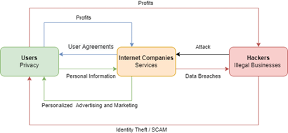

<!--StartFragment-->

## Introduction

In recent years, with the development of the Internet industry and the broad adoption of Big Data technologies, the public has become increasingly concerned about the topic of personal information protection. Whereas ten years ago, when people were not aware of the value of personal information, more of them were willing to trade their privacy for more convenient services. The attitudes toward personal information in the two eras are dramatically opposed.

Among the growing challenges to Internet security, previously highly prized Internet companies have been thrust into the front burner of public opinion. Questions have been raised over the means and purposes of collecting personal information from users by these technology giants. One of the most widely criticized is the so-called "The Biggest Lie on the Internet,” (Obar & Oeldorf-Hirsch, 2018) which is the user agreement and privacy policy provided by various Internet application developers.

Although various national and regional governments have been promoting their own personal information protection regulations over the years to restrict the harvesting and processing of users' personal information from Internet companies, by explicitly stipulating that application service providers must publicly specify in their user agreements and privacy policy documents the types of personal information collected through their services, how it is collected, and the purposes for which it is used. However, the reality is that these legal documents are often unnecessarily complicated and obscure, and most users do not pay attention to these contents. As a result, users unknowingly waive their rights and are unable to protect their personal information effectively.

Therefore, this paper will focus on the privacy policies of Internet companies and their user agreements with customers, analyze the conflicts between companies and customers regarding the security of personal information, and explore the purposes and methods of companies in controlling customers' privacy. Second, this paper will briefly introduce the existing approaches to personal information protection in various countries as well as compare and analyze their similarities and differences. Finally, this paper will outline what academics consider as potential measures to address privacy protection issues.

To provide background, this paper will start by analyzing the main reasons for Internet companies becoming the source of personal information breaches under the existing information exchange framework.

## Major Internet companies become the source of personal information breaches

As of January 2021, the Internet covers 60.9% of the world's population (Digital 2021, n.d.). The rapid growth of the Internet has led to an explosion of data. In addition, the development of technology has brought unprecedented convenience to the public. For example, a research paper published in 2019 presents a new user behavior prediction model, with an accuracy rate of 70% and applicable to 95.8% of the user population (Li et al., 2020). This model can help companies predict users' needs more accurately and push advertisements to users even before they are aware of their needs. The widespread adoption of Big Data technologies has helped Internet companies develop effective strategies to expand their market share (Li et al., 2020) and generate significant revenue. According to a survey conducted by S&P Capital IQ, vertical revenues for the online market are expected to increase by 44% in 2021 compared to 2019 (Internet Company Vertical Revenue Growth 2021, n.d.).

However, highly customized convenience services often require people to provide more information on a more personal basis. For example, companies with more than 1,000 employees already had more than 200 terabytes of data of their customers' personal information stored (Sahithreddy, 2020). As the Internet becomes more accessible, it is an accepted fact that cybersecurity conditions are getting worse. According to data collected by Statista, from 2005 to 2021, the number of data breaches in the United States increased by 63.7%. In particular, 1,001 data breaches occurred in the U.S. in 2020, exposing approximately 155.8 million personal information records. Meanwhile, the report notes that large companies with more than 1,000 employees have been impacted the most by cyber-attacks since 2016 . (U.S. Data Breaches and Exposed Records 2020, n.d.)

Throughout history, private data security has never been so closely tied to our social lives. Such conflict raises the question of whether personal privacy will be eliminated as technology evolves. Furthermore, an increasing number of negative news about Big Data applications came into public awareness. First, in 2012, Target used customers' shopping data to predict whether a customer was pregnant or not and sent coupons in advance to influence their shopping habits. As a result, people started to pay attention to the use of Big Data in business practices (Duhigg, 2013). Second, in 2013, The Wall Street Journal revealed that companies such as Staples.com offered different prices in online marketplaces based on customers' location information, which led to discussions about the misuse of personal information and companies' unfair treatment toward customers (Soltani, 2012). Then, in 2016, the largest data breach in history was revealed that hackers have stolen over three billion account information from Yahoo.com (Biggest Online Data Breaches Worldwide 2021, n.d.). And at last, the 2018 Facebook and Cambridge Analytica user information breach scandals have raised awareness to the fact that social media can have a practical impact on society (Facebook-Cambridge Analytica data harvesting, 2019). In these cases, we can see that large Internet companies are always at the center of public opinion. As holders of large amounts of user data, the mainstream Internet companies do not seem to be able to use these data appropriately or even to secure them effectively.

Based on the Internet data exchange infrastructure model (Alexandra Coghlan & Lewis Carter, 2020), this paper proposes a new simplified model to outline the security risks in the existing information exchange model (Figure 1). 

In Figure 1, the three rectangles respectively represent users (personal information producers), Internet companies (service providers), and hackers (illegal businesses). The arrows represent the flow of information:

1.	The green arrows indicate the transfer of personal information from the user to the Internet companies in exchange for customized services.
2.	The blue arrows indicate that the Internet companies provide the user agreement and privacy policy to the users in exchange for their consent to give personal information to the companies and gain revenue by providing services to the users.
3.	The red arrows indicate hackers steal users' personal information by attacking Internet companies' databases and making profits using these privacy data to run illegal businesses.

It is worth noting that these lines of information form a dead loop, and the user is the one who suffers the most. We can find that Internet companies have the most connections to the other two rectangles in this model and ultimately hold users' personal information and are directly connected to hackers. Given that large Internet companies are more vulnerable to cyber-attacks, we can conclude that Internet companies have the highest information security risk in this information exchange model, and the risk increases as the size of the company grows.

## Conflicts between Companies and Users

Before we delve into user agreements, it is important to establish a standard for the definition of personal information. There are various definitions of personal information from scholars, organizations and governments. We have chosen to show the General Data Protection Regulation (GDPR) definitions here as it has been used as a legal basis in actual cases (Facebook’s WhatsApp Slapped With $265 Million Fine For Violating Data Laws, n.d.). Although there are different personal information protection acts in different countries and regions, their definitions of privacy have remained consistent.[1] The GDPR defines privacy as any information that directly or indirectly identifies a natural person (“Art. 4 GDPR – Definitions,” n.d.). The specific types of information that applied to are grouped in the following three categories:

1.	Identify information, such as name, gender, age, address, email, occupation, educational background, finical information, family relationships, etc.
2.	Behavioral information, such as browsing history, location information, searching history, shopping records, etc.
3.	User-generated content, such as account ownership, posted photos and files, published articles, chatting logs, etc.

User Agreement can be one or a set of several contracts which has legal effect, as the operator of the Internet product provides the terms and conditions of the agreement in advance, stipulating the rights and obligations between the operator and the user. Facebook, for example, has been criticized for the state of its users' privacy since the Cambridge Analytica scandal. "Terms of Service; Didn't Read, a community project focused on analyzing and reviewing user agreements of major Internet companies, rated Facebook's terms of service as grade E   (Frontpage -- Terms of Service; Didn’t Read, n.d.). Facebook provides several legal documents regarding user data, including Terms of Service, Cookie Policy, Data Policy, and Community Standards. These user agreements are accepted by default when users use Facebook's services directly or indirectly. These terms explain what personal information Facebook collects and its use, but much of it could be considered unreasonable. For example, in Terms of Service, Facebook asks users to provide their real names when using their services. In addition, their Data Policy states that they collect information about the people, pages, accounts, hashtags, and groups connected to the user, and that they also collect users’ browsing and behavior records within the framework of their service. These records include, but are not limited to, content viewed, features used, interactions with others, and the time, frequency, and duration of activity. Facebook will also collect and store the user's facial recognition information when authorizing it. These types of personal information will also be shared with Facebook's third-party partners. Moreover, third-party data providers are important sources of users' personal information to Facebook. Regarding user-generated content, Facebook states in Terms of Service that users retain ownership of their data, but an additional clause in this document states, "[i]n addition, content you delete may continue to appear if you have shared it with others and they have not deleted it.” (Facebook, n.d.)

The personal information that Facebook collects includes identifying information, behavioral information, and user-generated content. Such information should be considered private, as GDPR's definition suggests, because it can directly or indirectly recognize a person's identity. Furthermore, the information collection should be done with the user's awareness. However, Facebook states in its Cookie Policy that personal information is collected regardless of whether the user has a Facebook account and "without any further action from you." Also, the GDPR emphasizes and requires strict restrictions on how users' personal information can be used. Nevertheless, in its Terms of Service, Facebook still requires users to permit it to use their personal information in ads, offers, and sponsored content displayed to others "without any compensation to you." (Facebook, n.d.)

Despite Facebook's notoriety for being involved in numerous user privacy violations, it altered its Terms of Service in October 2020. Announcing that it could remove users' content or restrict their activities at its discretion, in order to avoid legal or regulatory implications for Facebook (“Facebook Changes Terms of Service,” 2020). While some believe the revised version could help limit the spread of disinformation and fake news in the post-truth era, others believe it expands Facebook's control over user information and gives it excessive authority.

Similar pursuit in obtaining more users' personal information can be seen in the user agreements of other major Internet companies.  In a recent paper, researchers compared user agreements on social media from the United States and China, concluding that "Processing data and sharing data with third parties are common practices among both Chinese and U.S.-based social media.” (Stockmann et al., 2020). Unlike traditional companies, Internet companies are built on digital technology and do not have physical property as their base. Therefore, it is essential for their survival and profitability to acquire more data continuously and to maintain a constant data flow. Back in 2009, European Consumer Commissioner Meglena Kuneva had suggested that "Personal data is the new oil of the internet and the new currency of the digital world."(Haupt, 2018). Personal information is valuable because it can be used to track and identify valuable resources. Although in general, the value of individual pieces of personal information is not much. But, when the fragmented information is gathered into a whole, the value is very significant. For example, by integrating and analyzing the time and interaction behavior of a large number of users browsing the website, it is possible to reveal more economical and meaningful information, such as the characteristics of the whole market and more accurate predictive models of user behavior.

There is a significant power imbalance between Internet companies and users, forcing users to provide their personal information either knowingly or unknowingly. First, user agreements are not usually prominently displayed in complete to users during their use of a product or website. However, the user must click "Agree" on the registration page in order for the service to proceed on the website or product, otherwise the user is considered as not accepting the contract and not able to use the service. Jonathan Obar and Anne Hirsch's experiments found that the registration interface of Internet services intentionally implied that the user consent process was unimportant and discouraged users from participating in the consent process by enlarging the "quick-join" option and reducing the font size of the user agreement.(Obar & Oeldorf-Hirsch, 2017) This study reveals a direct link between such discouragement and the ignoring culture.

Second, more studies suggest that Internet companies are intentionally making user agreements more difficult to understand in order to force users away from reading them. A 2020 data visualization report collected user agreements for 21 popular APPs, and found that their average word count was about 5,588 words. For American adults with a 12th grade or college-level education it typically takes about 20 minutes to read (LePan, 2020). In another experiment conducted by Jonathan Obar and Anne Hirsch, it was noted that for a user agreement of average length, 74% of participants chose to skip without reading, while 97% of participants agreed to the policy after an average of 51 seconds of reading (Obar & Oeldorf-Hirsch, 2018). Apparently this is not enough for users to understand what data will be collected by the company who is providing the service, and how that data will be used. For APPs aimed at the youth, researchers from UCSD analyzed the readability of these Apps' user agreements using the reading grade level (RGL) and were surprised to find that the RGL of each of these documents was far above the average reading level of American adults (Das et al., 2018). As most adults can't understand these agreements, let alone the youth. 

Internet companies have an absolute advantage over their users. The major Internet platforms have an entire legal team to compose these user agreements. Their job is to enable the company to collect as much personal information as possible to keep the company in business and profitable, and to protect the company from being sued or fined. Therefore the precision of these documents takes priority over readability. The obscurity of the user agreement reveals its inherent information bias (“Why Facebook’s User Agreement Is Still Problematic,” 2020). In order to obtain useful information, users need to have a high level of information literacy. Internet products are intended for a wide range of users, and only a small percentage of them are capable of interpreting these legal documents. People are more inclined to avoid information when they think it is difficult to obtain or difficult to interpret (Sweeny et al., 2010). Most people are excluded by Internet companies' user agreements from knowing the extent of their privacy exposure and are unable to effectively protect their personal information. “An educated citizen should possess the ability to harness [information literacy] to enhance his or her own life and the lives of those around them (Flower, n.d.).” Obviously, Internet companies do not expect users to be aware of their power.

## Summary on readability of user agreement in current Personal Information Protection Act

The EU takes a leading position in the domain of personal information protection with its General Data Protection Regulation (GDPR), which was adopted in 2016 and came into effect in 2018. The "European Standard" has become the fundamental framework for defining and classifying private data in most countries. In the United States, there is not yet a comprehensive federal personal information protection law. However, many state-level legal regulations are dedicated to privacy protection. In particular, the California Consumer Privacy Act (CCPA), which takes effect on January 1, 2020, applies broadly to U.S. companies. China's Personal Information Protection Law (PIPL) started later than those of the EU and the US, and came into effect on November 1, 2021.

Although the cultural background, scope of application, and market size vary from country to country, the definitions of personal information in their existing personal information protection acts are generally similar. The United States' CCPA focuses more on privacy protection and therefore applies to fewer types of information than the European and Chinese Acts. All three Acts impose obligations on information processors and regulate the collection, storage, and use of personal information. And all three Acts require information processors to provide users with a user agreement in "a concise, transparent, intelligible and easily accessible form" (GDPR) when collecting personal information.

However, unfortunately, none of the three Acts provide a reference for the readability of user agreements. Therefore, the readability of current user agreements has not been much improved.

## Potential user agreement readability solutions

The main reason for the privacy problem is that users do not have a clear awareness of privacy. In addition, the current user agreement format is insufficient to effectively remind users of their rights to protect their personal information. Therefore, a more appealing method of communicating privacy policies to users will be necessary. 

A research paper published on Information Technology & People conducted an experiment by adding visualizations to Instagram's Privacy Policy and examined the effect of visualization on users' information privacy awareness level. The paper concluded that "visualized privacy policies lead to higher privacy awareness levels than conventional textual ones, especially when icons are included."(Soumelidou et al., 2020)

The visualizations used in Soumelidou and Tsohou’s experiment are merely simple and intuitive, but the result of readability improvement is quite significant. it provides a vision that there could be more sophisticated methods to enable a more effective understanding of privacy rights.

## Conclusion 

In the digital world, with the development of Big Data and the Internet, personal information has become an increasingly important business resource, causing a crazy scramble race among profit-oriented companies. Under the existing information exchange model, Internet companies have accumulated too much user privacy data, resulting in a massive misuse of personal information. User agreements and privacy policies are supposed to be tools for users to protect their legitimate rights, but in contrast, they have become obstacles that prevent the public from being aware of the privacy concerns. In order to solve the dilemma, legislation and regulation should adapt to the actual situation of users' information needs and guide companies to improve users' understanding of their rights. Furthermore, privacy protection should not be a constraint to business development. Reasonable boundaries can prevent confusion and enable the industry to grow further and better.

## References

- Alexandra Coghlan & Lewis Carter. (2020). New Product Design: Creating a Digital VR Game to Promote the Conservation of Nature-based Tourism Attractions (p. 179). Emerald Publishing Limited. https://doi.org/10.1108/978-1-83982-688-720201011
- Art. 4 GDPR – Definitions. (n.d.). General Data Protection Regulation (GDPR). Retrieved December 1, 2021, from https://gdpr-info.eu/art-4-gdpr/
- Biggest online data breaches worldwide 2021. (n.d.). Statista. Retrieved December 16, 2021, from https://www-statista-com.ezproxy.pratt.edu/statistics/290525/cyber-crime-biggest-online-data-breaches-worldwide/
- Das, G., Cheung, C., Nebeker, C., Bietz, M., & Bloss, C. (2018). Privacy Policies for Apps Targeted Toward Youth: Descriptive Analysis of Readability. JMIR MHealth and UHealth, 6(1), e3. https://doi.org/10.2196/mhealth.7626
- Digital 2021: Global Overview Report. (n.d.). DataReportal – Global Digital Insights. Retrieved December 15, 2021, from https://datareportal.com/reports/digital-2021-global-overview-report
- Duhigg, C. (2013). 24. How Companies Learn Your Secrets. In D. Starkman (Ed.), The Best Business Writing 2013 (pp. 421–444). Columbia University Press. https://doi.org/10.7312/star16075-025
- Facebook. (n.d.). Retrieved December 17, 2021, from https://www.facebook.com/legal/terms
- Facebook changes terms of service: So what does it mean? (2020, September 1). WANE 15. https://www.wane.com/news/facebook-changes-terms-of-service-so-what-does-it-mean/
- Facebook-Cambridge Analytica data harvesting: What you need to know - ProQuest. (n.d.). Retrieved December 15, 2021, from https://www.proquest.com/docview/2234441812?parentSessionId=Rt8kk5EzgjnHMj9WPz0R7NdyUjrDt0FUJ9FF1r2qbRw%3D&pq-origsite=summon&accountid=13158
- Facebook’s WhatsApp Slapped With $265 Million Fine For Violating Data Laws. (n.d.). Retrieved December 17, 2021, from https://dailycaller.com/2021/09/02/whatsapp-facebook-gdpr-data-privacy-fine-265-million/
- Flower, K. (n.d.). Research Guides: Information Literacy: Why do Information Literacy? Retrieved December 17, 2021, from https://library.mcla.edu/c.php?g=60780&p=658207
- Frontpage—Terms of Service; Didn’t Read. (n.d.). Retrieved December 1, 2021, from https://tosdr.org/en/frontpage
- Haupt, M. (2018, April 23). “Data is the New Oil”—A Ludicrous Proposition. Project 2030. https://medium.com/project-2030/data-is-the-new-oil-a-ludicrous-proposition-1d91bba4f294
- Internet company vertical revenue growth 2021. (n.d.). Statista. Retrieved December 15, 2021, from https://www-statista-com.ezproxy.pratt.edu/statistics/271579/internet-company-vertical-revenue-growth/
- LePan, N. (2020, April 18). Visualizing the Length of the Fine Print, for 14 Popular Apps. Visual Capitalist. https://www.visualcapitalist.com/terms-of-service-visualizing-the-length-of-internet-agreements/
- Li, Z., Zhang, X., Wang, Y., & Su, X. (2020). Predicting the sequential behavior of mobile Internet users based on MSM model. International Journal of Market Research, 62(6), 743–757. https://doi.org/10.1177/1470785319870161
- Obar, J. A., & Oeldorf-Hirsch, A. (2018). The Biggest Lie on the Internet: Ignoring the Privacy Policies and Terms of Service Policies of Social Networking Services (SSRN Scholarly Paper ID 2757465). Social Science Research Network. https://doi.org/10.2139/ssrn.2757465
- Obar, J. A., & Oeldorf-Hirsch, A. (2017). Clickwrap Impact: Quick-Join Options and Ignoring Privacy and Terms of Service Policies of Social Networking Services. Proceedings of the 8th International Conference on Social Media & Society, 1–5. https://doi.org/10.1145/3097286.3097336
- Sahithreddy. (2020, September 17). What is Big Data and How Facebook is Using Big Data? Medium. https://sahithreddy639.medium.com/what-is-big-data-and-how-facebook-is-using-big-data-d044fcd52948
- Soltani, J. V.-D., Jeremy Singer-Vine and Ashkan. (2012, December 24). Websites Vary Prices, Deals Based on Users’ Information. Wall Street Journal. https://online.wsj.com/article/SB10001424127887323777204578189391813881534.html
- Soumelidou, A., Tsohou, A., & Link to external site,  this link will open in a new window. (2020). Effects of privacy policy visualization on users’ information privacy awareness level: The case of Instagram. Information Technology & People, 33(2), 502–534. http://dx.doi.org/10.1108/ITP-08-2017-0241
- Stockmann, D., Garten, F., & Luo, T. (2020). Who is a PRC user? Comparing Chinese social media user agreements. First Monday. https://doi.org/10.5210/fm.v25i8.10319
- Sweeny, K., Melnyk, D., Miller, W., & Shepperd, J. A. (2010). Information Avoidance: Who, What, When, and Why. Review of General Psychology, 14(4), 340–353. https://doi.org/10.1037/a0021288
- U.S. data breaches and exposed records 2020. (n.d.). Statista. Retrieved December 1, 2021, from https://www.statista.com/statistics/273550/data-breaches-recorded-in-the-united-states-by-number-of-breaches-and-records-exposed/
- Why Facebook’s User Agreement is Still Problematic. (2020, March 23). ReadWrite. https://readwrite.com/2020/03/23/why-facebooks-user-agreement-is-still-problematic/

<!--EndFragment-->