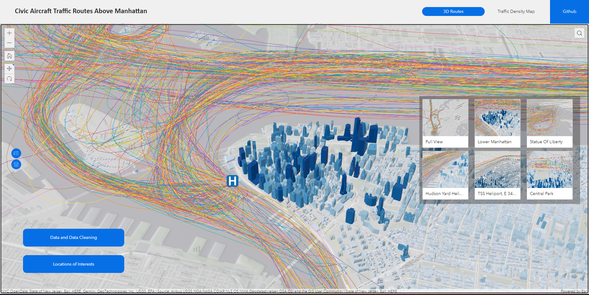

## Introduction

My friend Ziqi Wang and I have collaborated on a project that was inspired by her internship experience at BetaNYC during the summer. As part of her internship, she was tasked with creating a dashboard to showcase the distribution of helicopters in the air over Manhattan. Unfortunately, the project was not completed due to technical issues. However, I decided to join forces with Ziqi to expand the scope and content of the project. Our goal is to make a practical impact with this initiative and raise awareness about the aerial noise in the city.

## Data Processing

To gather the necessary data, we used the OpenSky API to request GPS tracking data for helicopters. The API provided location data every 4 seconds with a unique identifier number called "Icao24." We narrowed down the time scale to July 1, 2019, to improve response time.

After gathering the raw data, we cleaned the dataset using Python. Since the raw dataset didn't show independent trips, we created a function that checked the time gap between two entries for the same "Icao24." If the gap was greater than 60 seconds, we considered it a new trip. We then grouped the data entries by "Icao24" and indexed the groups of data from 0.

## Visualization

Once the data was cleaned and organized, we utilized ArcGIS to create a 3D map that showcased the helicopter routes over popular places in NYC. We used the XY to Point tool and added altitude (Z) data to the map. This step revealed an important detail: if we used the default projection, the resulting map would appear tilted and unappealing.

To produce a visually pleasing and accurate map, we matched the XY projection with the Z projection. We also utilized the Points to Line tool and sorted the dataset by the unique identification numbers "Icao24" for helicopters to visualize their routes. These adjustments not only improved the overall aesthetics of the map but also allowed for a more intuitive understanding of the data.

To add context, we used the New York, USA Buildings scene as the basemap. This provided a clear picture of how the helicopters navigated around popular landmarks like the Statue of Liberty, Central Park, various bridges, and airports on the edge of the city.

## Impact

The resulting map highlighted areas that were most affected by helicopter noise and helped users visualize the impact on the city's residents. This data can be used to make informed decisions about regulations or policies that can reduce the impact of helicopter noise.

## Conclusion

Data processing is a crucial step in any project that involves visualization. By utilizing the right tools and processes, we were able to clean and organize our data and create a visually pleasing and informative map that showcased helicopter routes in NYC. This map can be used to gain insights into the impact of helicopter noise and inform policy decisions to reduce its effects.

## Speacial Thanks

Thanks to Zhi Keng He from BetaNYC who provided us his username and password to access Opensky API. 



