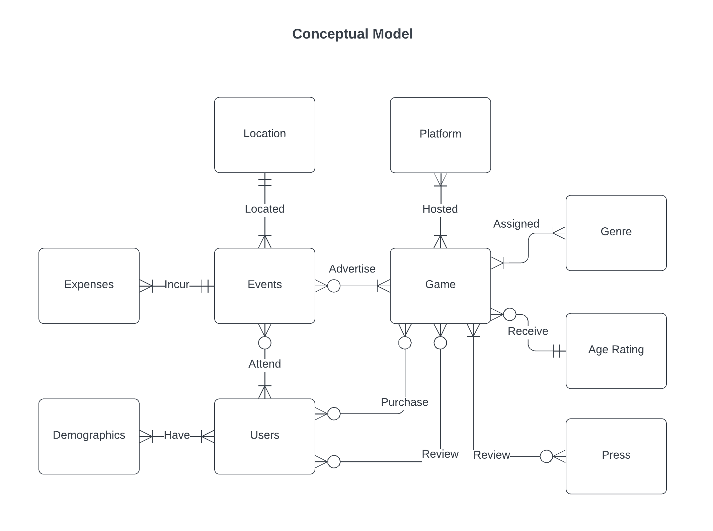

***Team Members:** Jiacheng Chen, Harrison Cortellesi, Xinyu Wang*

## Introduction

An indie game studio wishes to create a database that solves the operational challenges of its marketing team. Since the studio is understaffed, the team often finds itself having to take on additional financial and logistical responsibilities that occur when they try to maintain client relationships and manage marketing projects. These tasks require timely and reliable data in order to work properly, and high-quality results in these aspects not only benefit the marketing team, but also ensure the smooth running of the entire studio. Therefore, we are going to design and develop a database that addresses the specific challenges of the marketing team by centralizing the business operational data they need, which ensures data security, enhances data quality, and reduces data redundancies and inconsistencies across different segments of the studio.

## Identify Problems

The primary problem of the studio is that its data are kept in a fragmented manner. Our database will manage data centrally, representing the organization of various data and the connection between data through a relational model. Managing the studio's data through a central database will also effectively safeguard the data from possible errors due to data loss or incorrect updates. At the same time, the database can be used by all members of the studio. This implementation of data sharing will greatly improve the efficiency of data access and usage.

## Determine business rules

The main responsibilities of the marketing team occur in two fields: first, in order to manage client relationships, they will need to have a well-documented and promptly-updated client list (both for existing and prospective clients), which delineates all contact information of the client, the marketing projects they are involved in, and the respective employees assigned to each client. Secondly, they need a similar list for their existing and prospective marketing projects, which should include information on the employees assigned to the project, the game that is being marketed, and important logistical details about the project (such as location and time). 
To support this, the marketing team will also need basic information on all the games released by the studio and their sale data, both for reference purposes during communication with the client and to guide future marketing proposals. Since sponsoring is an important element of marketing, certain aspects of the supply chain data need to be included into the database as well. These data would include supplier information (name, location), shipment information of the products sent to clients, and so on. 

Last but not least, financial data on all the activities, including marketing projects but not strictly limited to them, of the marketing team must be made available, so that the budget is not overreached. This would include data such as studio budget, investor funding, type of expenses (eg. PR, marketing event), and the amounts of each expense that is incurred. General studio guidelines, such as quarterly financial and budget report information, should be incorporated as well, so that these financial data could be quickly summarized to produce actionable insights that guide future marketing projects.

**Business Rules:**

- A game can be hosted on 1 or many platforms.
- A platform can host many games.
- A game can be reviewed by 0 or many users.
- A user can review 0 or many games.
- A game can be purchased by 1 or many users. 
- A user can purchase 1 or many games. 
- A game can be advertised at 0 or many events.
- An event can advertise many games.
- A game can be assigned many genres.
- A genre can be assigned to many games.
- A game can receive 1 and only 1 age rating.
- An age rating can be received by many games.
- A game can receive 0 or many press reviews.
- A press can review 1 or many games.
- An event is hosted at 1 and only 1 location.
- A location hosts 1 or many events.
- An event can incur 1 or many expenses.
- An expense is incurred by 1 and only 1 event.
- An event is attended by many users.
- A user can attend 0 or many events.
- A user can have 1 and only 1 demographic.
- A demographic can belong to many users. 

## The Conceptual Model and The Entity Relationship Model

After carefully analyzing the Bussiness Rules. In our finalized database design, we decided to take what we had from our original proposal and streamline its scope significantly in order to fit the realistic demands of this project and to have a narrower focus in our database design. Our target user has not changed – the database will still be used by the marketing department of this indie gaming studio, but the problems we strive to solve with this database is much more closely connected with their fundamental responsibilities: instead of having scattered information on clients, sales, communication, and so on, we will instead focus on just user and sales data to help the team derive relevant insights and drive revenue for the company. 

Therefore, among the user needs identified in the original proposal, we decided to no longer support storage of human resources and client information, neither will our database support communication with the in-house development team; instead, we decided to focus on storage of data on marketing (promotional) events, game and their sales data, and as a new addition – user demographic data.



We expect the database we designed to answer the tasks listed below:

- Display the reviews and sales of each game title on various platforms. 
  - What is the best-selling game on Steam?
- Get demographic information about users who purchased games. 
  - What is the most common age group for the best-selling game in general?
- Display trends in sales and reviews of each game title.
  - Do the games’ ratings get better or worse with each title release? 
- Display market reaction to game titles before and after advertisements and events. 
  - Does the number of game titles’ reviews increase after an advertisement/event? 
- Show total expenses used in game advertisements and events. 
  - How much did each game spend on advertisements and events?


**Sample Queries:**

- When adding a new user into the “User” entity, add a trigger to test that their age is not less than 0 or greater than 100. If so, return a warning message. Test the trigger with a transaction.
- Display the reviews and sales of each game title on various platforms.
- What is the best-selling game available on PC?
- Get demographic information on users who purchased games. 
- What is the most common age group for the best-selling game in general?
- Delete user reviews that don’t have a rating.
- Change the race category from “Latino” to “Latin American”.
- Display trends in sales and reviews of each game title.
- Show total expenses used in game advertisements and events. 



```sql
DROP DATABASE IF EXISTS `FinalDB`;
CREATE DATABASE `FinalDB`;
USE `FinalDB`;

CREATE TABLE Genre_Type (
    Genre_Type_ID INT AUTO_INCREMENT,
    Name VARCHAR(20) NOT NULL,
    CONSTRAINT Genre_Type_PK PRIMARY KEY (Genre_Type_ID)
);

CREATE TABLE Press (
Press_ID INT AUTO_INCREMENT,
Name VARCHAR(50) NOT NULL,
Description VARCHAR(255),
CONSTRAINT Press_PK PRIMARY KEY (Press_ID)
);

CREATE TABLE Platform (
Platform_ID INT AUTO_INCREMENT,
Platform_Name VARCHAR(50) NOT NULL,
CONSTRAINT Platform_PK PRIMARY KEY (Platform_ID)
);

CREATE TABLE Location (
Location_ID INT AUTO_INCREMENT,
Name VARCHAR(50) NOT NULL,
Address VARCHAR(255) NOT NULL,
City VARCHAR(50) NOT NULL,
State CHAR(2) NOT NULL,
Zip INT(5) NOT NULL,
Capacity INT(10),
CONSTRAINT Location_PK PRIMARY KEY (Location_ID)
);

CREATE TABLE Demographic_Type (
Demographic_Type_ID INT AUTO_INCREMENT,
Type VARCHAR(50) NOT NULL,
CONSTRAINT Demographic_Type_PK PRIMARY KEY (Demographic_Type_ID)
);

CREATE TABLE ESRB_Rating (
ESRB_Rating_ID VARCHAR(4),
ESRB_Rating_Name VARCHAR(50) NOT NULL,
Description VARCHAR(255),
CONSTRAINT ESRB_Rating_PK PRIMARY KEY (ESRB_Rating_ID)
);

CREATE TABLE User (
User_ID INT AUTO_INCREMENT,
Fname VARCHAR(50) NOT NULL,
Lname VARCHAR(50) NOT NULL,
Address VARCHAR(50),
City VARCHAR(50),
State CHAR(2),
Zip INT(5),
DOB DATE,
CONSTRAINT User_PK PRIMARY KEY (user_ID)
);

-- Above is only PK below has FK 

CREATE TABLE Game (
Game_ID INT AUTO_INCREMENT,
Name VARCHAR(50) NOT NULL,
Release_Date DATE,
ESRB_Rating_ID VARCHAR(4) NOT NULL,
CONSTRAINT Game_PK PRIMARY KEY (Game_ID),
CONSTRAINT ESRB_Rating_FK FOREIGN KEY (ESRB_Rating_ID) 
	REFERENCES ESRB_Rating (ESRB_Rating_ID) ON UPDATE CASCADE ON DELETE CASCADE
);

CREATE TABLE Genre (
Genre_ID INT AUTO_INCREMENT,
Genre_Type_ID INT NOT NULL,
Game_ID INT NOT NULL,
CONSTRAINT Genre_PK PRIMARY KEY (Genre_ID),
CONSTRAINT Genre_Genre_Type_ID_FK FOREIGN KEY (Genre_Type_ID) 
	REFERENCES Genre_Type(Genre_Type_ID) ON UPDATE CASCADE ON DELETE CASCADE,
CONSTRAINT Genre_Game_ID_FK FOREIGN KEY (Game_ID) 
	REFERENCES Game(Game_ID) ON UPDATE CASCADE ON DELETE CASCADE
);

CREATE TABLE Press_Review (
Press_Review_ID INT AUTO_INCREMENT,
Press_ID INT NOT NULL,
Game_ID INT NOT NULL,
Content VARCHAR(500),
Score INT,
Review_Date DATE,
CONSTRAINT Press_Review_PK PRIMARY KEY (Press_Review_ID),
CONSTRAINT Press_Review_Press_ID_FK FOREIGN KEY (Press_ID) 
	REFERENCES Press(Press_ID) ON UPDATE CASCADE ON DELETE CASCADE,
CONSTRAINT Press_Review_Game_ID_FK FOREIGN KEY (Game_ID) 
	REFERENCES Game(Game_ID) ON UPDATE CASCADE ON DELETE CASCADE
);

CREATE TABLE Purchase (
Purchase_ID INT AUTO_INCREMENT,
Game_ID INT NOT NULL,
User_ID INT NOT NULL,
Purchase_Date DATE,
CONSTRAINT Purchase_PK PRIMARY KEY (Purchase_ID),
CONSTRAINT Purchase_Game_ID_FK FOREIGN KEY (Game_ID) 
	REFERENCES Game(Game_ID) ON UPDATE CASCADE ON DELETE CASCADE,
CONSTRAINT User_Purchase_FK FOREIGN KEY (User_ID) 
	REFERENCES User(User_ID) ON UPDATE CASCADE ON DELETE CASCADE
);

CREATE TABLE Review (
Review_ID INT AUTO_INCREMENT,
User_ID INT NOT NULL,
Game_ID INT NOT NULL,
Platform_ID INT NOT NULL,
Content VARCHAR(255),
Score INT,
Review_Date DATE,
CONSTRAINT Review_PK PRIMARY KEY (Review_ID),
CONSTRAINT Review_User_ID_FK FOREIGN KEY (User_ID) 
	REFERENCES User(User_ID) ON UPDATE CASCADE ON DELETE CASCADE,
CONSTRAINT Review_Game_ID_FK FOREIGN KEY (Game_ID) 
	REFERENCES Game(Game_ID) ON UPDATE CASCADE ON DELETE CASCADE,
CONSTRAINT Review_Platform_ID_FK FOREIGN KEY (Platform_ID) 
	REFERENCES Platform(Platform_ID) ON UPDATE CASCADE ON DELETE CASCADE
);

CREATE TABLE Host (
Host_ID INT AUTO_INCREMENT,
Game_ID INT NOT NULL,
Platform_ID INT NOT NULL,
CONSTRAINT Host_PK PRIMARY KEY (Host_ID),
CONSTRAINT Host_Game_ID_FK FOREIGN KEY (Game_ID) 
	REFERENCES Game(Game_ID) ON UPDATE CASCADE ON DELETE CASCADE,
CONSTRAINT Host_Platform_ID_FK FOREIGN KEY (Platform_ID) 
	REFERENCES Platform(Platform_ID) ON UPDATE CASCADE ON DELETE CASCADE
);

CREATE TABLE Event (
Event_ID INT AUTO_INCREMENT,
Location_ID INT NOT NULL,
Name VARCHAR(50) NOT NULL,
Date DATE,
Start_Time TIME,
End_Time TIME,
CONSTRAINT Event_PK PRIMARY KEY (Event_ID),
CONSTRAINT Event_Location_ID_FK FOREIGN KEY (Location_ID) 
	REFERENCES Location(Location_ID) ON UPDATE CASCADE ON DELETE CASCADE
);

CREATE TABLE Advertising (
Advertising_ID INT AUTO_INCREMENT,
Game_ID INT NOT NULL,
Event_ID INT NOT NULL,
Advertisment_Type VARCHAR(50),
Start_Time TIME,
End_Time TIME,
CONSTRAINT Advertising_PK PRIMARY KEY (Advertising_ID),
CONSTRAINT Advertising_Game_ID_FK FOREIGN KEY (Game_ID) 
	REFERENCES Game(Game_ID) ON UPDATE CASCADE ON DELETE CASCADE,
CONSTRAINT Advertising_Event_ID_FK FOREIGN KEY (Event_ID) 
	REFERENCES Event(Event_ID) ON UPDATE CASCADE ON DELETE CASCADE
);

CREATE TABLE Expenses (
Expenses_ID INT AUTO_INCREMENT,
Event_ID INT NOT NULL,
Amount INT,
CONSTRAINT Expenses_PK PRIMARY KEY (Expenses_ID),
CONSTRAINT Expenses_Event_ID_FK FOREIGN KEY (Event_ID) 
	REFERENCES Event(Event_ID) ON UPDATE CASCADE ON DELETE CASCADE
);

CREATE TABLE Attendance (
Attendance_ID INT AUTO_INCREMENT,
User_ID INT NOT NULL,
Event_ID INT NOT NULL,
CONSTRAINT Attendance_PK PRIMARY KEY (Attendance_ID),
CONSTRAINT Attendance_User_ID_FK FOREIGN KEY (User_ID) 
	REFERENCES User(User_ID) ON UPDATE CASCADE ON DELETE CASCADE,
CONSTRAINT Attendance_Event_ID_FK FOREIGN KEY (Event_ID) 
	REFERENCES Event(Event_ID) ON UPDATE CASCADE ON DELETE CASCADE
);

CREATE TABLE Demographic (
Demographic_ID INT AUTO_INCREMENT,
User_ID INT NOT NULL,
Demographic_Type_ID INT NOT NULL,
Value VARCHAR(50),
CONSTRAINT Demographic_PK PRIMARY KEY (Demographic_ID),
CONSTRAINT Demographic_User_ID_FK FOREIGN KEY (User_ID) 
	REFERENCES User(User_ID) ON UPDATE CASCADE ON DELETE CASCADE,
CONSTRAINT Demographic_Demographic_Type_ID_FK FOREIGN KEY (Demographic_Type_ID) 
	REFERENCES Demographic_Type(Demographic_Type_ID) ON UPDATE CASCADE ON DELETE CASCADE
);

-- Now onto adding the data

INSERT INTO Genre_Type (Genre_Type_ID, Name)
VALUES(1, 'Fantasy'),
(2, 'Horor'),
(3, 'Adventure'),
(4, 'Simulation'),
(5, 'First Person Shooter'),
(6, 'Sandbox'),
(7, 'Action'),
(8, 'Puzzle'),
(9, 'Role Playing Game'),
(10, 'Strategy'),
(11, 'Real Time Strategy'),
(12, 'Sports'),
(13, 'Party Games'),
(14, 'Survival'),
(15, 'Platformer'),
(16, 'Rhythm'),
(17, 'Tower Defense'),
(18, 'Idle'),
(19, 'Rougelike'),
(20, 'Virtual Reality');

INSERT INTO Press (Name, Description)
VALUES("Gamer United",'Casual gamers who review games'),
("Game Informer","An American monthly video game magazine featuring articles, news, strategy, and reviews of video games and associated consoles."),
("IGN", "An American video game and entertainment media website."),
("GameSpot", "An American video gaming website that provides news, reviews, previews, downloads, and other information on video games."), 
("Switch player", "A video gaming magazine that features news and columns regarding the Nintendo Switch."),
('GameFAQs', 'A group that tries to answer all questions that its base may have about upcoming games'),
('Kotaku', 'An organization focused on creating guides and reviewing new games'),
('Polygon', 'Blocky games are our specialty'),
('Metacritic', 'Reviews, quotes, and composite review scores from major critics for film, video, DVD, music, and video games.'),
('PCGamer', 'PC master race'),
('PCWorld', 'A group that review all PC games'),
('Giantbomb', 'A company that focuses on studying and understanding what causes the greatest bombs of the year'),
('ReviewBomber', 'A group known for leaving terrible reviews'),
('ReditReviews', 'Idiots on the internet with nothing better to do than criticize everything');

INSERT INTO Platform (Platform_Name)
VALUES('Playstation'),
('Switch'),
('Xbox'),
('PC'),
('IOS'),
('Android');

INSERT INTO Location (Name, Address, City, State, Zip, Capacity)
VALUES("Mom's Basement", "123 Virgin Lane", "New York", "NY", 58008, 420),
("Eduardo's Empanada", "234 Repulgue Street", "DeSoto", "TX", 75115, 1000),
("Warby Mansion", "345 Kerouac Memorial Lane", "River Wards", "PA", 19124, 500),
("Crouching Pomegranate, Flying Scallion", "456 Blossom Street", "Berkeley", "CA", "94705", 2000);

INSERT INTO Demographic_Type (Type)
VALUES('Race'),
('Gender');

INSERT INTO ESRB_Rating (ESRB_Rating_ID, ESRB_Rating_Name, Description)
VALUES('E', 'Everyone', 'Content is generally suitable for all ages. May contain minimal cartoon, fantasy or mild violence and/or infrequent use of mild language.'),
('E10+', 'Everyone 10+', 'Content is generally suitable for ages 10 and up. May contain more cartoon, fantasy or mild violence, mild language and/or minimal suggestive themes.'),
('T', 'Teen', 'Content is generally suitable for ages 13 and up. May contain violence, suggestive themes, crude humor, minimal blood, simulated gambling and/or infrequent use of strong language.'),
('M', 'Mature', 'Content is generally suitable for ages 17 and up. May contain intense violence, blood and gore, sexual content and/or strong language.'),
('A', 'Adult', 'Content suitable only for adults ages 18 and up. May include prolonged scenes of intense violence, graphic sexual content and/or gambling with real currency.');

INSERT INTO User (Fname, Lname, Address, City, State, Zip, DOB)
VALUES('Radcliff', 'Daniel', 'Gryffindor Tower', 'Hogwarts', 'NY', '00334', '1980-07-31'),
("Sekishusai", "Yagyu", "Yagyu Village", "Nara", "NJ", "07051", "1971-01-01"),
("Duarte", "Eva", "Los Toldos", "Buenos Aires", "CO", "80013", "1945-05-17"),
("Solomons", "Alfie", "Camden Town", "London", "TX", "73301", "1998-08-28"),
("Relatto", "Dominique", "156 Calle Nizao, Guaricano", "Santo Domingo", "IA", "50613", "1984-12-01"),
("Wao", "Manaka", "567 Qingbai Avenue", "Wu Xuan", "IA", "52402", "2000-03-27"),
('Anikin', 'Skywalker', 'Jedi Temple', 'Coruscant', 'SW', '01138', '1977-05-04'),
('Bob', 'The Builder', "88 Builder's Lane", 'Bobsville', 'SV', '08867', '1999-04-12'),
("Sherlock", "Holmes", "221B Baker Street", "London", 'UK', '22112', '1962-12-13'),
("Cassandra", "Krovendo", "13 Umbral Lane", "Shadowville", 'AK', '12358', '1998-02-09'),
("Benjamin", "Weaver", "863 Country Drive", "Kansas City", 'MO', '64151', '1918-01-22'),
("Brisa", "Orozco", "9335 Sleepy Hollow Avenue", "Massillon", 'OH', '44646', '2000-01-23'),
("Selena", "Farrell", "765 East Windfall Street", "Deerfield Beach", 'FL', '33442', '1986-07-27'),
("Brenton", "Hurst", "940 Bridgeton Street", "Auburn", 'NY', '13021', '1996-08-14'),
("Madilyn", "Gibson", "8 53rd Court", "Hernando", 'MS', '38632', '1945-07-30'),
("Aydan", "Gibbs", "68 South Jackson Drive", "Nashville", 'TN', '37205', '2001-07-08'),
("Alia", "Poole", "35 Brewery Drive", "Shelton", 'CT', '06484', '1988-06-14'),
("Sean", "Gutierrez", "8402 Wild Horse Drive", "Opa Locka", 'FL', '33054', '1954-11-06'),
("Anahi", "Hayden", "642 Edgewater Road", "Palatine", 'IL', '60067', '1980-09-22'),
("Heather", "Robinson", "132 Kingston Street", "Whitestone", 'NY', '11357', '1997-08-25');


INSERT INTO Game (Name, Release_Date, ESRB_Rating_ID)
VALUES("Murder Hobo's Adventure", '2018-11-05', 'E'),
('Teletubbies The Game', '2000-05-04', 'A'),
("The Legend of Tachibana", '2012-12-05', 'M'),
('The Mandala Effect', '2017-01-01', 'E10+'),
('Plague Maker', '2019-12-21', 'T'),
('Shotgun King', '2022-05-12', 'T'),
('FPS Chess', '2022-05-21', 'T'),
('Choo-Choo Charles', '2022-12-09', 'M'),
('Dance Dance Revolution', '1998-09-26', 'E'),
('Zen Idle', '2019-07-06', 'E'),
('Donkey Kong', '1981-07-09', 'E'),
('Dungeons and Dragons', '2012-01-09', 'T'),
('AdVentureCapitalism', '2014-05-20', 'E'),
('AdVentureCommunism', '2015-04-20', 'E'),
('IdleBrickBreaker', '2020-09-13', 'E'),
('The Tower', '2021-10-01', 'E'),
('Almost A Hero', '2019-01-01', 'E'),
('DigDug', '1982-04-19', 'E10+'),
('Galaga', '1981-09-21', 'E10+'),
('Mario Super Sluggers', '2008-08-25', 'E');

INSERT INTO Genre (Genre_Type_ID, Game_ID)
VALUES(2,2),
(3,2),
(5,2),
(7,2),
(8,1),
(9,3),
(3,3),
(8,4),
(4,5),
(6,5),
(11,5),
(9,6),
(10,6),
(19,6),
(5,7),
(10,7),
(20,7),
(12,7),
(2,8),
(3,8),
(7,8),
(14,8),
(17,8),
(13,9),
(16,9),
(18,10),
(15,11),
(1,12),
(6,12),
(9,12),
(18,13),
(18,14),
(18,15),
(18,16),
(17,16),
(18,17),
(9,17),
(15,18),
(15,19),
(12,20),
(3,20);

INSERT INTO Press_Review (Press_ID, Game_ID, Content, Score, Review_Date)
VALUES(3,1,"Backed by the suspenseful music of Jans Limmer, full of buck-wild characters with witty quotes, and at all times exhilarating and heart-pumping, Murder Hobo's world is a thrill to explore.", 90, "2021-12-01"),
(4,1,"For better or for worse, Murder Hobo's Adventure takes inspiration both from 70s slasher films and dark Celtic fairy tales. The unlikely combination may throw some viewers off and bring others a giggle.", 83, "2021-12-25"),
(2,2, "Despite its name, Teletubbies the Game is not children-friendly. In this game of pixel-perfect shootouts, we are invited to sit down with the creators of the game and relive our traumatic childhood experiences and shoot them away.", 75, "2000-07-01"),
(1,3, "The famous onna-musha clan of ancient Japan revives itself to take a spin on the merry, merry-go-rounds of an apocalyptic Coney Island. Hell hath no fury like a woman samurai scorned.", 80, "2013-01-01"),
(3,3, "All the falconeris of the nuclear-ravaged world could not stop this woman with her nun sisters on a mission. A translucently transcendent tranquilizer of a game that turns saw to dust and beard to shavings.", 87, "2013-02-01"),
(5,4, "A clever play on the meditational musings of mandalas and its dangerous psycho-reactive effect on the human libido and ambition. The caterwauling of a copycat is what keeps us hooked to the 8-bit screen.", 93, "2017-01-10"),
(4,4, "A poet once said every day is the same day just like every soul lives in the same consciousness. This game shows us the (im)possibility of reincarnating as a Tibetan lama through the 1-2-3-4 drills of OM-induced coma.", 88, "2017-02-01"),
(13,15, "Definitely a thrill to be witnessing the flying maneuvers of a mouse uncontrolled. Every cybersecurity person’s worst nightmare.", 75, "2020-09-30"),
(10,5, "Every day is a new day except yesterday. When the apocalypse comes, where will you hide but the bomb-shattered fragments of your nostalgic abode? This is the question the game throws at us.", 80, "2020-01-01"),
(13,6, "Where are we going? The kitten asks its mother. In a stream-of-consciousness that knows not its limits nor its end, we witness the glory that is yesterday, our future. Where time reigns without a queen.", 78, "2022-06-01"),
(12,7, "At no point does a wandering nomad use a bayonet fixed to a rifle. When the driver hits its brakes, you will risk puncturing your comrade but the woman would still be intact after three  decades.", 78, "2022-07-01"),
(11,8, "A peek into the most fun-loving parts of humanity. The game plays like mother’s stewed beef and carrots, an effervescent smell akin to that famous madeleine. This new release from the company will have your tears flowing out even if you have not cried since childhood.", 95, "2023-01-01"),
(7,9, "This is what in Hawaii or Easter Island they would call an iconography. Do you know that's sacrilege? Profound questions thrown to us by the developers will have no answers without an adequate algorithm.", 71, "2001-01-01"),
(6,10, "Better not sorry than safe. The opened leaf of a stained notebook invokes memories of a room escape game. Gamers who’ve peeked into the binoculars of that anonymous attic understand the mechanics.", 73, "2020-01-01"),
(6,18, "A dazzling display of RPG ghoul combat at its finest, the game nevertheless suffers from a stroke of a genius and every other part felt sketchily-done.", 78, "1983-01-01"),
(14,20, "A razor-sharp gameplay that demands the user to parry every attack, forcing the adoption of a learning process that perchance leaks into real life.", 97, "2009-01-01"),
(8,13, "When the elders go rogue instead of the common teenager scapegoats. The return of the pack does bring back the heyday of gangsta-shootout games of the 70s.", 97, "2014-06-01"),
(9,16, "Inspired by stolen fire, what was presented to us is akin to the passionate suffering of centuries of Malaysian craftsmen and the quiet dedication of single fathers.", 76, "2021-11-01"),
(10,11, "Held together by a loose narrative complexity, the game dips in and out of parlor favorites to enter in the labyrinth of a Borgesian world. Death, but not necessarily the Compass.", 88, "1989-11-01"),
(7,12, "While some will resist this rumbling of philosophies, others will enjoy its cheesy effect on the psyche – something even the best philosophers cannot help but share with the human kind.", 90, "2012-02-01");

INSERT INTO Purchase (Game_ID, User_ID, Purchase_Date)
VALUES(1, 3, "2022-03-03"),
(1, 5, "2022-09-01"),
(2, 6, "2001-09-01"),
(2, 1, "2010-09-01"),
(3, 4, "2013-11-13"),
(3, 3, "2014-12-05"),
(4, 1, "2017-05-05"),
(4, 2, "2017-08-03"),
(4, 4, "2019-02-03"),
(4, 6, "2020-10-20"),
(5, 20, "2020-08-08"),
(6, 19, "2022-12-12"),
(7, 18, "2022-12-21"),
(8, 17, "2022-12-10"),
(9, 16, "2020-05-20"),
(10, 15, "2020-10-15"),
(11, 14, "2020-06-03"),
(12, 13, "2020-07-09"),
(13, 12, "2020-06-14"),
(14, 11, "2020-08-09"),
(15, 10, "2020-01-06"),
(16, 9, "2020-11-09"),
(17, 8, "2020-12-02"),
(18, 7, "2020-03-30"),
(19, 6, "2020-02-05"),
(20, 5, "2020-04-11");

INSERT INTO Review (User_ID, Game_ID, Platform_ID, Content, Score, Review_Date)
VALUES(1, 20, 4, "I don't know why I even bothered to buy this game that only brings me headaches and muscle pains.", 50, "2010-12-31"),
(1, 19, 3, "The beautiful landscape of Budala.. or, Budapest? Nearly took my breath away. We are all here on a mission.", 95, "2017-12-31"),
(3, 18, 2, "What an awesome game to kill all your bloodshot hours in", 97, "2022-07-01"),
(6, 17, 1, "Masako killed me so many times but I still crawled back every time until I finished him. Absolutely ingenious design just fell short on execution.", 79, "2015-01-01"),
(7, 16, 1, "This may be a mare but the samurai horse has been beaten to death already. I have to admit that there are some thoughtful touches to the game but they didn't carry it out thoroughly.", 67, "2013-12-05"),
(9, 15, 3, "I am usually not a puzzle or a spiritual person but I swear I could hear the tolling bells of Tibet through this game.", 89, "2020-06-07"),
(10, 14, 2, "The new release from this independent studio is like everything you want from a horror flick but waaay more sophisticated, without any of the cheap jump scares", 95, "2022-09-05"),
(11, 13, 4, "Not the best representation of what a pixelated retro game should be but not bad either. If you want to kill time I guess.", 70, "2002-02-03"),
(12, 12, 3, "If you are a puzzle lover you have to buy this game. I recommend playing it with a friend.", 85, "2020-10-30"),
(13, 11, 3, "If I count every time I scream in this game I would be able to fall asleep.", NULL, "1989-11-01"),
(14, 20, 2, "Fantastically boring.", 10, "2009-01-02"),
(15, 17, 5, "I only wish the graphics were better.", 70, "2019-03-05"),
(16, 14, 4, "And I only wish the combat is better.", NULL, "2016-01-01"),
(17, 13, 4, "I guess this is a different way to do FPS…? Not sure if I’m loving it.", NULL, "2014-07-08"),
(18, 12, 3, "Definitely a relationship-wrecker. My boyfriend refused to cook for me after playing this, lool.", 100, "2015-05-01"),
(19, 11, 3, "Just another hero-villain story set in outer space. Where’s that personal touch?", 88, "1995-11-01"),
(20, 10, 3, "I don’t understand why everybody is hating on this game. Sure, some aspects fall short but I love it overall.", 92, "2022-02-02"),
(2, 19, 2, "So many head-scratching moments in this game that not even my finals were this stressful. In a good way, though.", NULL, "1990-09-21"),
(4, 17, 2, "Part of my family hated this game because I spent too long playing it..", 77, "2019-05-01"),
(5, 5, 1, "Not bad for a first attempt but the storyline needs to be worked on.", 81, "2020-04-03"),
(6, 4, 3, "This isn't how I remembered it going when I played it at a friends house last year", 99, "2022-12-12"),
(1, 4, 3, "I recently returned to this game after I stopped playing for three years due to me beating it back in 2017 and half of the game wasn't how I remembered it but it was still fun", 75, "2022-12-14");

INSERT INTO Host (Game_ID, Platform_ID)
VALUES(2, 4),
(4, 3),
(1, 2),
(3, 1),
(5,3),
(6,4),
(7,4),
(8,4),
(9,3),
(10,5),
(10,6),
(11,1),
(12,4),
(13,5),
(13,6),
(14,5),
(14,6),
(15,5),
(15,6),
(16,5),
(16,6),
(17,5),
(17,6),
(18,1),
(19,1),
(20,1);

INSERT INTO Event (Location_ID, Name, Date, Start_Time, End_Time)
VALUES(1, "All Gamers Unite", "2011-07-08", "10:00", "16:00"),
(2, "2017 Best Game of the Year Awards", "2017-12-15", "17:00", "22:00"),
(3, "East Coast Game Show", "2013-05-01", "08:00", "18:00"),
(4, "2021 Comi-Con", "2021-03-01", "10:00", "20:00"),
(2, "2018 Best Game of the Year Awards", "2018-12-15", "17:00", "22:00"),
(2, "2019 Best Game of the Year Awards", "2019-12-15", "17:00", "22:00"),
(2, "2020 Best Game of the Year Awards", "2020-12-15", "17:00", "22:00"),
(2, "2021 Best Game of the Year Awards", "2021-12-15", "17:00", "22:00"),
(3, "2017 World Game Release Convention", "2017-11-11", "12:00", "22:00"),
(3, "2018 World Game Release Convention", "2018-11-11", "12:00", "22:00"),
(3, "2019 World Game Release Convention", "2019-11-11", "12:00", "22:00"),
(3, "2020 World Game Release Convention", "2020-11-11", "12:00", "22:00"),
(3, "2021 World Game Release Convention", "2021-11-11", "12:00", "22:00"),
(3, "a", "2021-12-13", "18:00", "22:00"),
(3, "b", "2021-12-12", "19:00", "22:00"),
(3, "c", "2021-12-11", "17:00", "22:00"),
(4,  "2017 Comi-Con", "2017-03-01", "10:00", "20:00"),
(4,  "2018 Comi-Con", "2018-03-01", "10:00", "20:00"),
(4,  "2019 Comi-Con", "2019-03-01", "10:00", "20:00"),
(4,  "2020 Comi-Con", "2020-03-01", "10:00", "20:00");

INSERT INTO Advertising (Game_ID, Event_ID, Advertisment_Type, Start_Time, End_Time)
VALUES(2, 1, "gaming station", "12:00", "16:00"),
(4, 2, "display advertising", "17:00", "22:00"),
(3, 3, "print advertising", "08:00", "18:00"),
(1, 4, "gaming station and display advertising", "13:00", "20:00"),
(5, 5, "display advertising", "17:00", "22:00"),
(6, 6, "display advertising", "17:00", "22:00"),
(7, 7, "display advertising", "17:00", "22:00"),
(8, 8, "display advertising", "17:00", "22:00"),
(9, 9, "print advertising", "12:00", "22:00"),
(10, 10, "display advertising", "12:00", "22:00"),
(11, 11, "display advertising", "12:00", "22:00"),
(12, 12, "display advertising", "12:00", "22:00"),
(13, 13, "display advertising", "12:00", "22:00"),
(14, 14, "display advertising", "18:00", "22:00"),
(15, 15, "display advertising", "19:00", "22:00"),
(16, 16, "display advertising", "17:00", "22:00"),
(17, 17, "gaming station and display advertising", "10:00", "20:00"),
(18, 18, "gaming station and display advertising", "10:00", "20:00"),
(19, 19, "gaming station and display advertising", "10:00", "20:00"),
(20, 20, "gaming station and display advertising", "10:00", "20:00");

INSERT INTO Expenses (Event_ID, Amount)
VALUES(1, 5000),
(2, 10000),
(3, 30000),
(4, 7000),
(5, 6000),
(6, 25000),
(7, 95000),
(8, 3500),
(9, 95),
(10, 8500),
(11, 7430),
(12, 1025),
(13, 1138),
(14, 1337),
(15, 69420),
(16, 42069),
(17, 7200),
(18, 5500),
(19, 3800),
(20, 50000);

INSERT INTO Attendance (User_ID, Event_ID)
VALUES(1, 4),
(1, 3),
(2, 1),
(3, 2),
(4, 4),
(5,20),
(6,19),
(7,18),
(8,17),
(9,16),
(10,15),
(11,14),
(12,13),
(13,12),
(14,11),
(15,10),
(16,9),
(17,8),
(18,7),
(19,6),
(20,5);

INSERT INTO Demographic (User_ID, Demographic_Type_ID, Value)
VALUES(1, 1, "White"),
(1, 2, "Male"),
(2, 1, "Asian"),
(2, 2, "Male"),
(3, 1, "Latino"),
(3, 2, "Female"),
(4, 1, "White"),
(4, 2, "Male"),
(5, 1, "Black"),
(5, 2, "Male"),
(6, 1, "Latino"),
(6, 2, "Male"),
(7, 1, "White"),
(7, 2, "Male"),
(8, 1, "White"),
(8, 2, "Male"),
(9, 1, "White"),
(9, 2, "Male"),
(10, 1, "Asian"),
(10, 2, "Female"),
(11, 1, "Black"),
(11, 2, "Male"),
(12, 1, "Latino"),
(12, 2, "Female"),
(13, 1, "White"),
(13, 2, "Female"),
(14, 1, "White"),
(14, 2, "Male"),
(15, 1, "White"),
(15, 2, "Female"),
(16, 1, "Latino"),
(16, 2, "Male"),
(17, 1, "Asian"),
(17, 2, "Female"),
(18, 1, "Latino"),
(18, 2, "Male"),
(19, 1, "Black"),
(19, 2, "Female"),
(20, 1, "Black"),
(20, 2, "Female");
```




```sql
## When adding a new user into the “User” entity, add a trigger to test that their age is not less than 0 or greater than 100. If so, return a warning message. Test the trigger with a transaction.

DROP TRIGGER IF EXISTS `finaldb`.`user_AFTER_INSERT`;

DELIMITER $$
USE `finaldb`$$
CREATE DEFINER=`root`@`localhost` TRIGGER `user_AFTER_INSERT` after INSERT ON `user` FOR EACH ROW BEGIN
select new.dob into @temp;
SELECT TIMESTAMPDIFF(YEAR, @temp, CURDATE()) INTO @age;
	   IF @age < 0 THEN
		   signal sqlstate '45000' 
		   set message_text = 'Age should be greater than 0';
	   ELSEIF @age > 100 THEN
		   signal sqlstate '45000' 
		   set message_text = 'Age should be less than 100';
	   END IF;
END$$
DELIMITER ;

Begin;
INSERT INTO user(Fname, Lname, Address, City, State, Zip, DOB)
VALUES('John','Doe','sample address','sample city','XX','55555','2030-01-01');
INSERT INTO user(Fname, Lname, Address, City, State, Zip, DOB)
VALUES('John','Doe','sample address','sample city','XX','55555','1900-01-01');
INSERT INTO user(Fname, Lname, Address, City, State, Zip, DOB)
VALUES('John','Doe','sample address','sample city','XX','55555','2020-01-01');
Rollback;
select * from user;


## Display the reviews and sales of each game title on various platforms. 

CREATE VIEW Review_Sales_Comparison AS
SELECT g.Name AS Game, r.Content as Review, Score as Rating, COUNT(p.Game_ID) as Sale
FROM game g
Left JOIN review r ON g.Game_ID = r.Game_ID
JOIN purchase p ON g.Game_ID = p.Game_ID
GROUP BY Game, Review, Rating
ORDER BY Sale DESC;

Select * From Review_Sales_Comparison;


## What is the best-selling game available on PC?

CREATE VIEW Best_Selling_PC AS
SELECT Name, Count(Name) AS Sale FROM Purchase
JOIN Game ON Game.Game_ID = Purchase.Game_ID
where Purchase.Game_ID IN (SELECT Host.Game_ID From Host WHERE Platform_ID=4)
GROUP BY Name
ORDER BY COUNT(Name) DESC
LIMIT 1;

SELECT * FROM best_selling_PC;


## Get demographic information about users who purchased games. 

SELECT Type, Value, COUNT(Value) From Demographic
JOIN Demographic_Type ON Demographic_Type.Demographic_Type_ID = Demographic.Demographic_Type_ID
GROUP BY Type, Value
ORDER BY Type ASC;


## What is the most common age group for the best-selling game in general?

CREATE VIEW Age_Best_Selling_All AS
SELECT Name, CONCAT((FLOOR(DATE_FORMAT(FROM_DAYS(DATEDIFF(NOW(), DOB)), '%Y')/10)*10), ' - ', FLOOR(DATE_FORMAT(FROM_DAYS(DATEDIFF(NOW(), DOB)), '%Y')/10)*10+9) AS Most_Popular_Age_Category
From Purchase
JOIN User ON User.User_ID = Purchase.User_ID
JOIN Game ON Game.Game_ID = Purchase.Game_ID
WHERE Purchase.Game_ID IN (SELECT Purchase.Game_ID FROM Purchase
                        GROUP BY Purchase.Game_ID
                          HAVING COUNT(*) =(SELECT MAX(nor) FROM
                            (SELECT Purchase.Game_ID, COUNT(*) AS nor FROM Purchase GROUP BY Purchase.Game_ID) Purchase)
                        ORDER BY COUNT(*))
Group BY Name, Most_Popular_Age_Category
ORDER BY COUNT(Most_Popular_Age_Category) DESC
LIMIT 1;

SELECT * FROM age_best_selling_all;


## Delete user reviews that don’t have a rating.

BEGIN;
SELECT * FROM Review;
DELETE FROM Review where Score IS NULL;
SELECT * FROM Review;
COMMIT;


## Change the race category “Latino” to “Latin American”.

BEGIN;
UPDATE Demographic SET Value = REPLACE(Value, "Latino", "Latin American") WHERE Value = "Latino";
COMMIT;


## Display trends in sales and reviews of each game title.

SELECT game.Game_ID,game.Name as Game, AVG(review.Score) as Rating,
COUNT(purchase.Game_ID) as Sale,
CONCAT(
MONTHNAME(purchase.purchase_date)," ",
year(purchase.purchase_date))
as Time
FROM game
LEFT JOIN review ON game.game_id = review.game_id
LEFT JOIN purchase ON game.game_id = purchase.game_id
GROUP BY Name, Time, game.Game_ID
ORDER BY Name;


## Show total expenses used in game advertisements and events. 

SELECT SUM(amount) FROM expenses;


## How much did each game spend on advertisements and events?

SELECT game.name, advertising.Advertising_ID, expenses.Amount
FROM game
LEFT JOIN advertising on advertising.game_id = game.game_id
LEFT JOIN event on event.event_ID = advertising.event_id
LEFT JOIN expenses on expenses.event_id = event.event_id;


```

