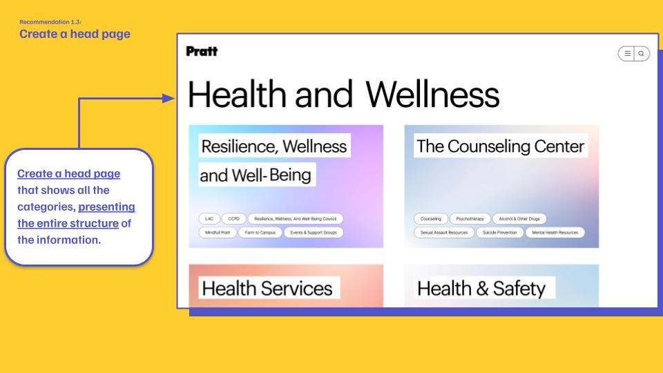
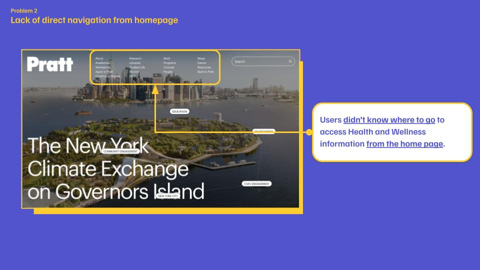
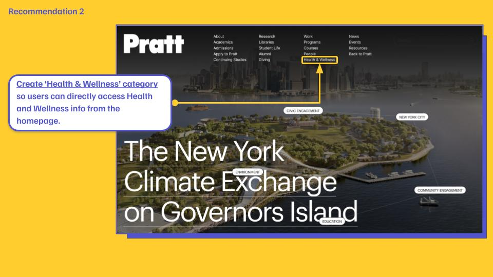
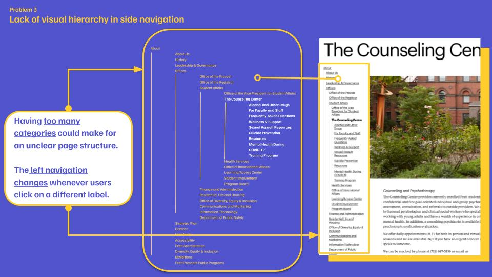
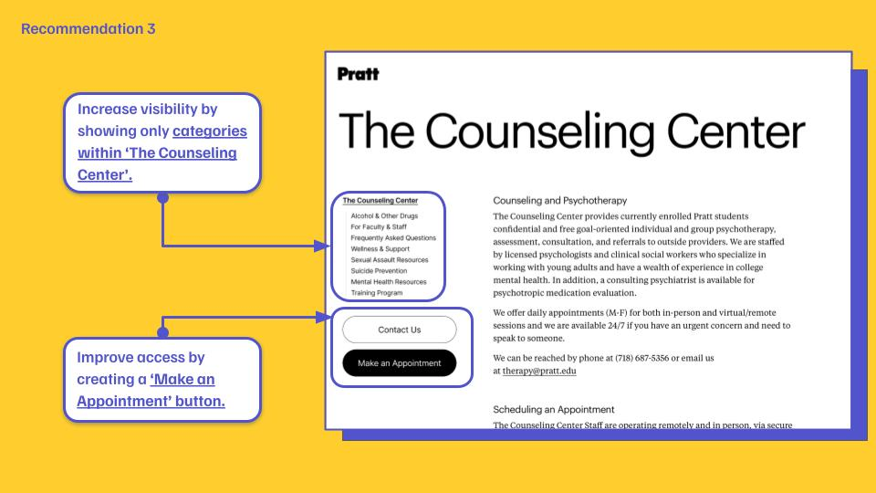
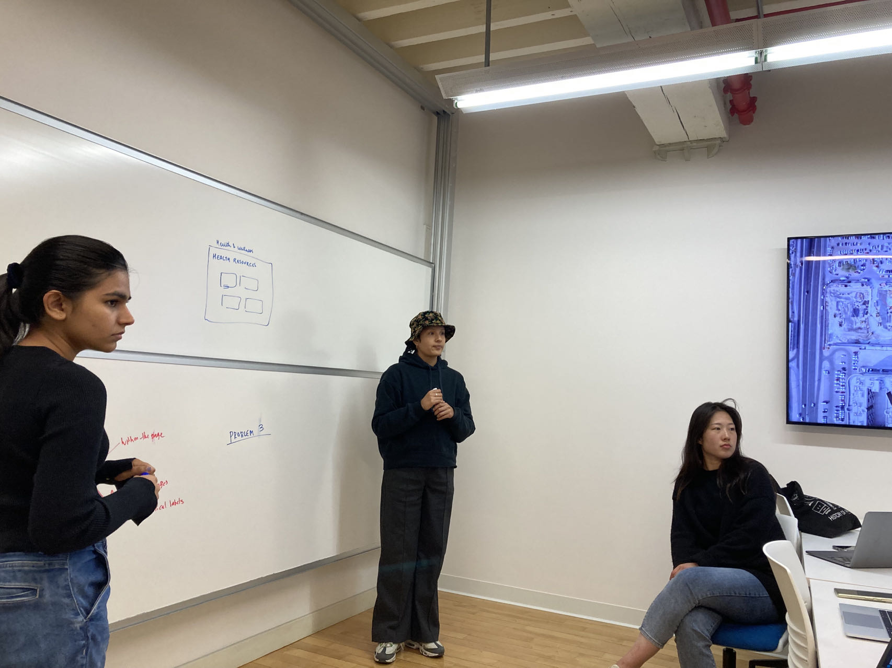

## Introduction

As a member of a team of five student researchers, I'm excited to share our experience in a UX project to improve the usability of the Pratt Institute website! Our client, Pratt Institute, is a prestigious arts college located in Brooklyn, New York. We aimed to improve the user experience of students accessing critical information on the Institute's Health Services, Counseling Center, and Resilience, Health and Wellness web pages. This article will describe the goals and scope of the project, our methodology, the process we followed, the issues we identified, our recommendations, and the conclusions of the project.

<!--  -->

## Goals and Scope

Pratt Institute approached our team to identify usability issues with their health and wellness web pages and to provide recommendations to enhance the overall user experience. Pratt Institute is currently working to become a JED Campus, a program designed by the Jed Foundation to guide the school's efforts in existing student mental health, substance use, and suicide prevention through comprehensive systems, program, and policy development. Therefore, it was critical to test the Pratt website to ensure that students and other users could easily find these resources. The pages we focused on included the Counseling Center, Health and Safety, and Resilience, Health and Wellness pages. Initially, the scope of the project included students, teachers, and parents, and assessed whether multilingual support would be beneficial for non-native English speakers. However, due to time constraints, we narrowed our target group to undergraduate students.

## Methodology 

### Moderated User Testing

To quickly reveal usability issues with the web pages, we employed Moderated User Testing. We developed an protocol that included three scenarios, each designed to explore how users navigate these pages to obtain key information. During user testing, we asked participants to think-aloud, which means to speak out their thoughts as they were completing the task. We observed their responses and took notes about the test data for analysis.

### Competitive Analysis

We also conducted a competitive analysis comparing Pratt Institute with other universities' Health Services related pages. We selected other art schools such as Rhode Island School of Design (RISD), School of Visual Arts (SVA), Parsons School of Design, and universities located in New York City, namely Barnard College and New York University. This analysis allowed us to identify best practices and potential areas for improvement.

## Process

### Participant Recruitment

Our first challenge was to recruit participants for the user testing program. We used a variety of methods, including email, student message groups, and campus outreach, to connect with potential participants. We recorded their contact information in a spreadsheet to ensure they were representative of our target user group: undergraduate students.

### Conducting Interviews

Following user testing, we conducted interviews with participants to learn more about their experiences. We took detailed notes during the interviews and collected valuable quotes that illustrated the participants' thoughts and feelings about their experience navigating the site.

### Data Analysis

We used the RICE Scoring Model to prioritize the issues we found and also analyzed the transcripts of the interview participants to understand what was frustrating them. We then considered the competitor sites' strengths. These analyses helped us to develop a series of recommendations to improve the usability of the site.

---
## Problems Identified and Recommendations

Through our user testing and interviews, we identified several key problems in these three aspects: 

1. **Content Structure**
2. **Homepage Navigation**
3. **Side Navigation**

To address these key issues, we come up with more detailed findings and recommendations.

---

{} 

### 001 Content Structure

##### Individual pages

1. Lack of *Content Hierarchy* & *Text Heavy*

2. There are 2 pages for the same topic

##### Across 3 pages
  
3. Information scattered across the 3 pages
     - Each page does not have concise categorical labels.
     - Information is scattered on each page which confuses users. 
     - Users get confused and do not know where to go to access specific information.

{}

**Solutions**

The website's various pages suffer from a lack of content hierarchy and are text heavy, making it difficult for users to quickly identify important information. In addition, two pages covered the same topic, which added to the confusion. To address these issues, we recommend creating an "Book an Appointment" button for easy access and unifying the "Resilience," "Health," and "Happiness" categories under one parent page to simplify content organization and improve the user experience.

The problem with all three pages was that the information was disorganized and the category labels were vague, making it difficult for users to find the specific details they were looking for. To solve this problem, we recommend creating a header page that displays all the categories in a clear and organized manner, effectively presenting the entire information structure. This approach will help users to better understand the layout of the site and find the information they need more efficiently.

---

{}
### 002 Homepage Navigation

 **Lack of direct navigation from homepage**

  > “I think Health and Wellness information is in Resources?”

Users have difficulty finding the "Health and Wellness" section when navigating from the home page because it is not easily identified by the labels in the header navigation of the site.

{}

**Solutions**

To address this issue, we suggest adding a new label that clearly identifies the "Health & Wellness" section so that users can easily find it. This new label would work in conjunction with the earlier mentioned head page to provide a more coherent and user-friendly navigation experience for those seeking health and wellness information.

---

{}
### 003 Side Navigation

**Lack of visual hierarchy in side navigation**

> “I don’t want to see so many links on left side when I’m on the Counseling Center page.”

Users are overwhelmed by the number of links in the side navigation bar, which makes it difficult for them to find the information they need.

{}

**Solutions**

To address this issue, we recommend only displaying relevant categories within the "Consulting Center" to improve readability. This simplifies the navigation process and allows users to focus on the essential content. In addition, we can further improve accessibility and simplify the process for users when trying to schedule an appointment for mental health services by creating an "Make an Appointment" button.

---
## Conclusion

In conclusion, our team gained valuable experience during the UX project for Pratt Institute's Health and Wellness webpage. Our testing and analysis revealed several key usability issues, including a lack of content hierarchy, navigation issues, and a cluttered side navigation bar. Through our competitive analysis, we identified best practices and potential areas for improvement. Mainly，we recommended creating a head page unifying similar contents under one parent page, adding new navigation label for easier navigation, and simplifying the side navigation bar to improve site usability.

We presented our findings and recommendations to our clients on May 3rd, 2023. They were very pleased with our findings and found them helpful in improving the usability of their website. 

The project lasted approximately eight weeks, during which time we had to meet several milestones, including drafting interview protocols, conducting interviews, and presenting our findings and recommendations to the client. The team faced several challenges during the project, such as recruiting participants, and shifting the project scope. However, we were able to overcome these challenges and complete the project successfully. I was honored to work with my team members, **Sehyun Jeon, Vi Kobal, Itzamna Huerta, and Nehal Sharma** on this project. We all learned a lot from the adventure.

## Considerations for Future Work

Although our team was not able to test other user groups due to time constraints, we did gather valuable insights from our interviewees about multilingual Support. Eight of the ten participants were non native English speakers and expressed interest in the possibility of offering multilingual options on the Pratt Institute website. 

Students' mental health issues are a complex topic that requires the attention of multiple parties, including their parents and college faculty and staff. Future work could include a more in-depth study of multilingual support and its impact on the user experience of other user groups.

## Appendix

### Presentation

<iframe src="https://docs.google.com/presentation/d/e/2PACX-1vT230qFBgngks7WJLhgDKA28hTRv6wbYrs_os79sNTov6R1JKeKa9nCCU5gX6F3rSUaEVLAqz50NCUQ/embed?start=true&loop=true&delayms=1000" frameborder="0" width="100%" height="500" allowfullscreen="true" mozallowfullscreen="true" webkitallowfullscreen="true"></iframe>

### User Testing Protocol



### Meet the group ;)

[A mindmap of this article](mindmap.html)