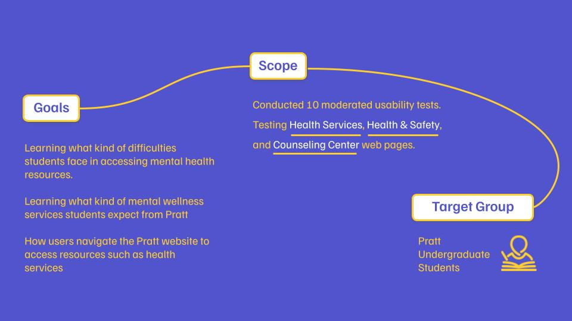
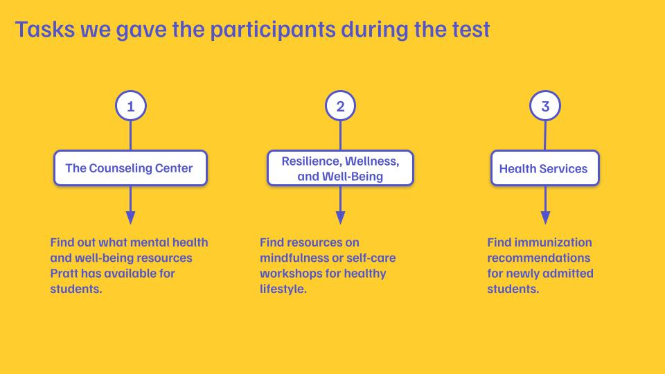
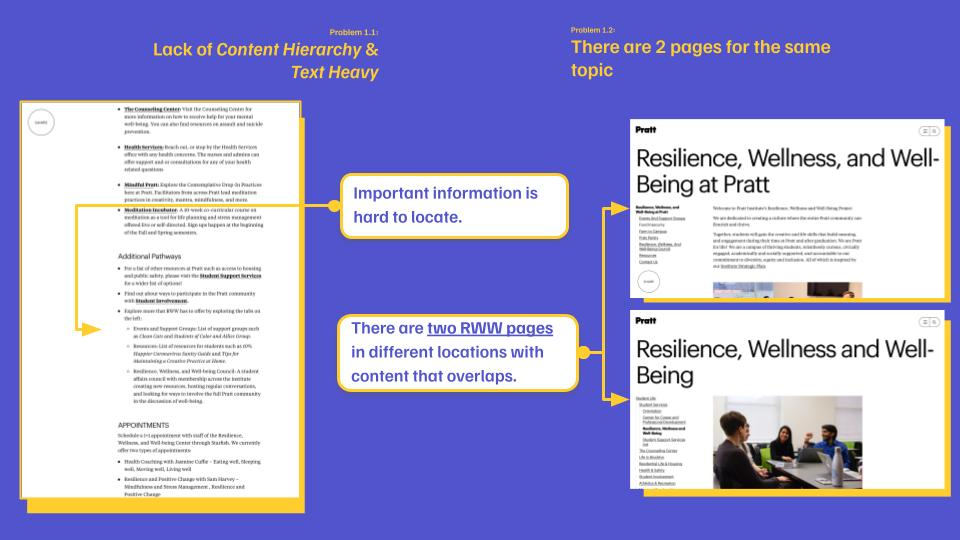
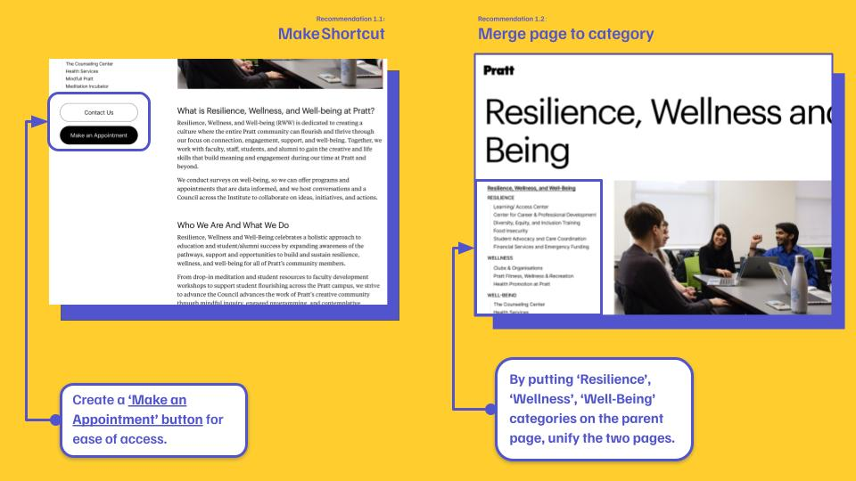

## Introduction

As a member of a team of five student researchers, I'm excited to share our experience in a UX project to improve the usability of the Pratt Institute website! Our client, Pratt Institute, is a prestigious arts college located in Brooklyn, New York. We aimed to improve the user experience of students accessing critical information on the Institute's Health Services, Counseling Center, and Resilience, Health and Wellness web pages. This article will describe the goals and scope of the project, our methodology, the process we followed, the issues we identified, our recommendations, and the conclusions of the project.

## Goals and Scope

Pratt Institute approached our team to identify usability issues with their health and wellness web pages and to provide recommendations to enhance the overall user experience. Pratt Institute is currently working to become a JED Campus, a program designed by the Jed Foundation to guide the school's efforts in existing student mental health, substance use, and suicide prevention through comprehensive systems, program, and policy development. Therefore, it was critical to test the Pratt website to ensure that students and other users could easily find these resources. The pages we focused on included the Counseling Center, Health and Safety, and Resilience, Health and Wellness pages. Initially, the scope of the project included students, teachers, and parents, and assessed whether multilingual support would be beneficial for non-native English speakers. However, due to time constraints, we narrowed our target group to undergraduate students.

## Methodology 

### Moderated User Testing

To quickly reveal usability issues with the web pages, we employed Moderated User Testing. We developed an protocol that included three scenarios, each designed to explore how users navigate these pages to obtain key information. During user testing, we asked participants to think-aloud, which means to speak out their thoughts as they were completing the task. We observed their responses and took notes about the test data for analysis.

### Competitive Analysis

We also conducted a competitive analysis comparing Pratt Institute with other universities' Health Services related pages. We selected other art schools such as Rhode Island School of Design (RISD), School of Visual Arts (SVA), Parsons School of Design, and universities located in New York City, namely Barnard College and New York University. This analysis allowed us to identify best practices and potential areas for improvement.

## Process

### Participant Recruitment

Our first challenge was to recruit participants for the user testing program. We used a variety of methods, including email, student message groups, and campus outreach, to connect with potential participants. We recorded their contact information in a spreadsheet to ensure they were representative of our target user group: undergraduate students.

### Conducting Interviews

Following user testing, we conducted interviews with participants to learn more about their experiences. We took detailed notes during the interviews and collected valuable quotes that illustrated the participants' thoughts and feelings about their experience navigating the site.

### Data Analysis

We used the RICE Scoring Model to prioritize the issues we found and also analyzed the transcripts of the interview participants to understand what was frustrating them. We then considered the competitor sites' strengths. These analyses helped us to develop a series of recommendations to improve the usability of the site.

## Problems Identified and Recommendations

Through our user testing and interviews, we identified several key problems in these three aspects: 

1. Content Structure

   > *“It’s frustrating that I couldn’t find the contact information”*

2. Homepage Navigation

   > *“Isn’t Student Life for residential information at Pratt?!”*

3. Side Navigation

   >*“Too many links! It’s confusing”*

To address these key issues, we come up with more detailed findings and recommendations.

#### 001 Content Structure

1. Lack of *Content Hierarchy* & *Text Heavy*

2. There are 2 pages for the same topic

**Solutions**

#### 002 