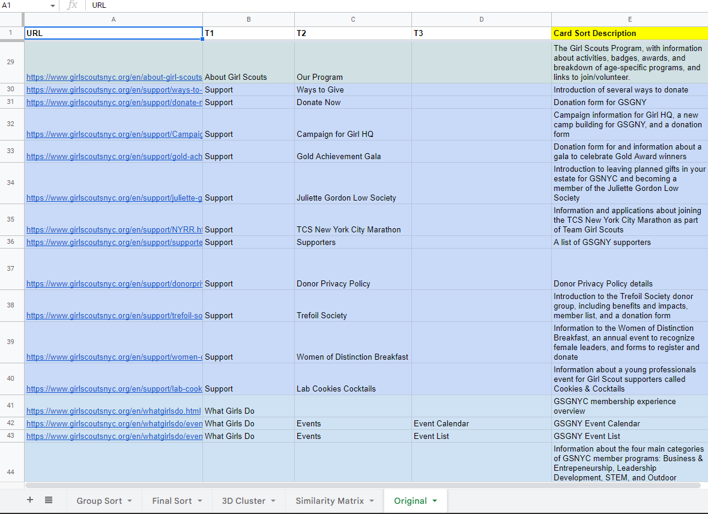
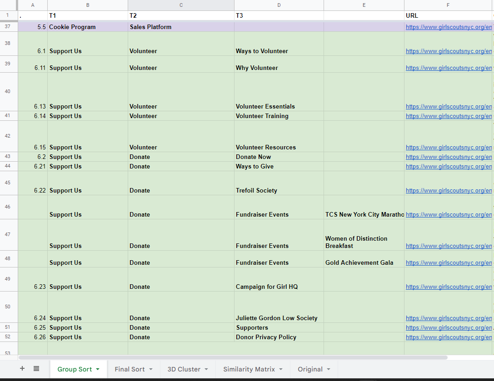

As a well-established organization with a rich history, the Girl Scouts of Greater New York have a wealth of information on their website. However, the complex structure of the website can make it difficult for current and prospective caregivers to find the information they need. Our team's goal is to understand the information needs of caregivers and redesign the website to better meet those needs by reorganizing the information on the website and implementing visual design elements to make it easier for caregivers to find what they are looking for.

> We use caregiver rather than parent to more accurately describe the identity of the person caring for the child, such as grandparent, sibling, guardian, etc.

## Know the Users

As designers, it is essential that we understand the needs and preferences of our users before we begin any design work. To gather this information, we conducted user research using three methods: interviews, card sorting, and tree testing. These methods allowed us to gain a deeper understanding of our users' needs and helped us to structure the website content in a way that better meets those needs.

### Talk to Real People

None of our team members had prior experience with Girl Scouts, so we decided to talk to people who knew about it, and ideally, those who were current or future caregivers. We conducted four interviews with questions about their opinion about girl scouts and extracurricular programs in general, combined with a short survey of their information access preferences that helped us make sense about the results. 

During the interviews, the participants shared their personal stories about the benefits of girl scouts or extracurricular activities for themselves or someone they knew. They highlighted several factors that they consider when choosing a program for children in their care, such as the organization's core values, the cost of participation, the location and schedule, and character-building qualities. Some participants also emphasized the importance of the program's approachability and the potential for gender stereotypes.
{}
Key Findings

### What Information Do Caregivers Care the Most?

When deciding whether to register their children in an extracurricular program, caregivers are likely to be interested in several key aspects of the program. These can be summarized into five main categories:

1. **Information about the programs:** Caregivers will want to know details about the programs being offered, including the age range of children who can participate, the activities offered, and any additional information about the program.
2. **Location and accessibility:** Caregivers will need to know where the program is located and how to get there. They may also be interested in transportation options or discounts for families living in certain areas.
3. **Cost and financial assistance:** Caregivers will need to know the cost of the program and whether financial assistance is available.
4. **Testimonials or reviews:** Caregivers may find it helpful to read reviews or testimonials from other parents who have enrolled their children in the program.
5. **Ways to give back:** Caregivers may be interested in learning about ways they can contribute to the program or organization, such as volunteering or making donations.

In addition to the content itself, users also appreciate a website that is easy to navigate and has a clear, organized layout. This makes it easier for them to find the information they are looking for and to use the website effectively.
{}
### Start By Condensing Content

After understanding the needs and preferences of our users through our interviews and surveys, we began the process of reviewing the current structure and content of the GSGNY website. To do this, we created a spreadsheet with a sitemap of the website and analyzed the content of each page. We looked for opportunities to consolidate pages with repetitive or overlapping content and to reorganize the content in a way that would be more intuitive and user-friendly. This helped us to create a more efficient and effective website for our users.

## Restructure The Website - Making Key Information Stands Out
#### Card Sorting and Tree Testing

Based on the initial condensed site structure, we wanted to test its functionality with a larger number of users. Card sorting and tree testing were effective techniques that helped us to evaluate our judgment in organizing the content and finalizing the information structure of the website. We conducted these tests with eight participants and followed each test with a brief interview to gather their thoughts on the tested structure.

The results from card sorting showed us how the users would like to condense the structure that make them access information more effective. We compared the user generated structures with ours and adjusted ours to better 

After comparing our structure to the one created by our users, we discovered significant discrepancies. In order to better meet the needs of our users, we carefully analyzed the results and made adjustments to our structure. We then conducted tasks based tree tests to further refine the changes.
### The Final Sitemap
#### How Do Others Do it?

It is effective to learn from the competitors about their strengths and weaknesses. Our team analyzed the information structures and visual elements of six extracurricular program websites that target similar audiences. We then used this information to inform our own strategies and improve our own website.

Below are some of the key findings that we applied in our website:

| What to Implement                                            | What to Avoid                                                |
| ------------------------------------------------------------ | ------------------------------------------------------------ |
| Make the vision clear on the home page to help people understand the values of the organization. | Avoid confusing navigation that may cause users to become lost on the website. |
| Highlight the pages that are relevant to the user's current location. | Links or labels that do not provide any feedback indicating that they are clickable. |
| Use a variety of font sizes and styles, but maintain consistency | Avoid minimizing program information - it is important to explain the benefits of participation to potential participants. |