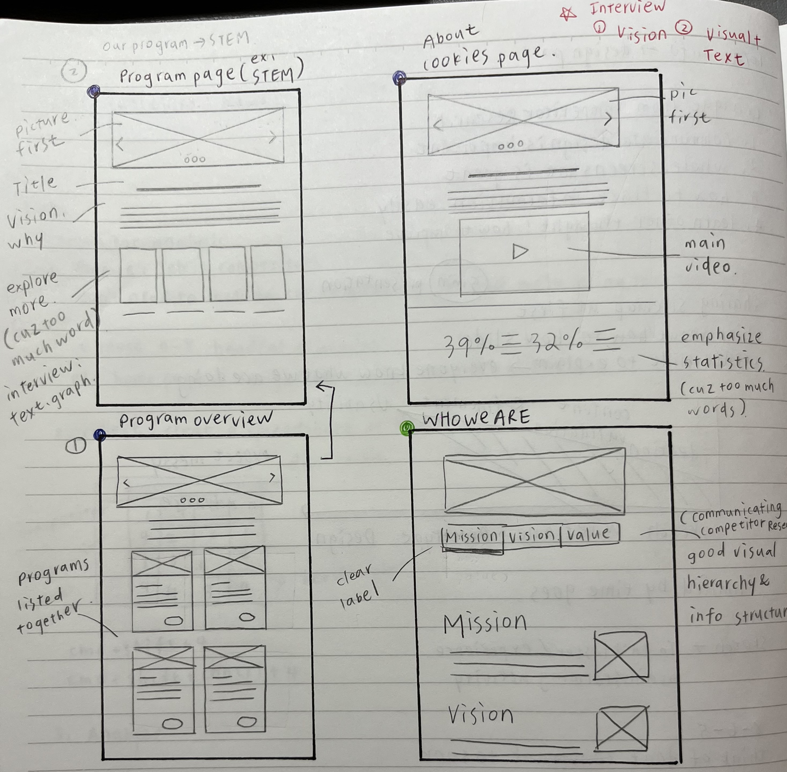
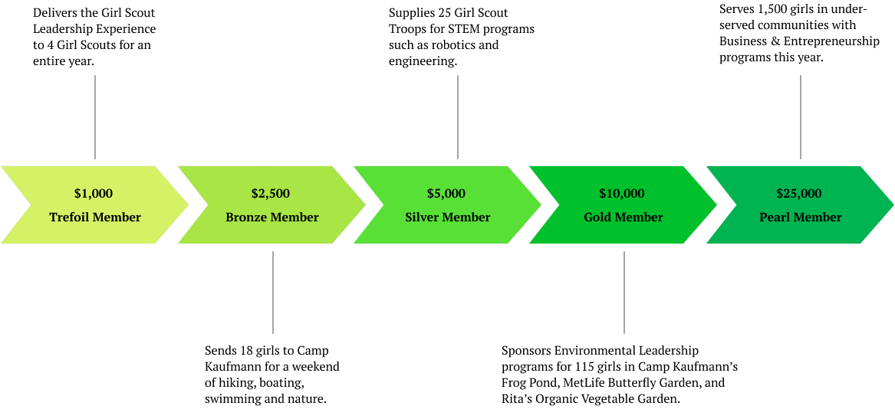
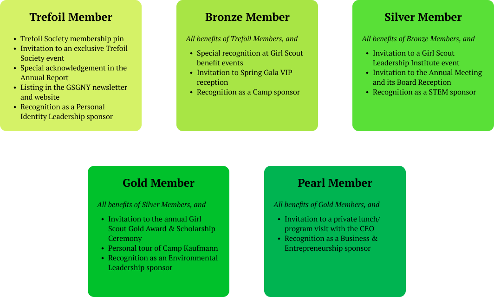

As a well-established organization with a rich history, the Girl Scouts of Greater New York have a wealth of information on their website. However, the complex structure of the website can make it difficult for current and prospective caregivers to find the information they need. Our team's goal is to understand the information needs of caregivers and redesign the website to better meet those needs by reorganizing the information on the website and implementing visual design elements to make it easier for caregivers to find what they are looking for.

> We use caregiver rather than parent to more accurately describe the identity of the person caring for the child, such as grandparent, sibling, guardian, etc.

## Know the Users

As designers, it is essential that we understand the needs and preferences of our users before we begin any design work. To gather this information, we conducted user research using three methods: interviews, card sorting, and tree testing. These methods allowed us to gain a deeper understanding of our users' needs and helped us to structure the website content in a way that better meets those needs.

### Talk to Real People

None of our team members had prior experience with Girl Scouts, so we decided to talk to people who knew about it, and ideally, those who were current or future caregivers. We conducted four interviews with questions about their opinion about girl scouts and extracurricular programs in general, combined with a short survey of their information access preferences that helped us make sense about the results. 

During the interviews, the participants shared their personal stories about the benefits of girl scouts or extracurricular activities for themselves or someone they knew. They highlighted several factors that they consider when choosing a program for children in their care, such as the organization's core values, the cost of participation, the location and schedule, and character-building qualities. Some participants also emphasized the importance of the program's approachability and the potential for gender stereotypes.

{}
Key Findings

#### What Information Do Caregivers Care the Most?

When deciding whether to register their children in an extracurricular program, caregivers are likely to be interested in several key aspects of the program. These can be summarized into five main categories:

1. **Information about the programs:** Caregivers will want to know details about the programs being offered, including the age range of children who can participate, the activities offered, and any additional information about the program.
2. **Location and accessibility:** Caregivers will need to know where the program is located and how to get there. They may also be interested in transportation options or discounts for families living in certain areas.
3. **Cost and financial assistance:** Caregivers will need to know the cost of the program and whether financial assistance is available.
4. **Testimonials or reviews:** Caregivers may find it helpful to read reviews or testimonials from other parents who have enrolled their children in the program.
5. **Ways to give back:** Caregivers may be interested in learning about ways they can contribute to the program or organization, such as volunteering or making donations.

In addition to the content itself, users also appreciate a website that is easy to navigate and has a clear, organized layout. This makes it easier for them to find the information they are looking for and to use the website effectively.
{}
### Start By Condensing Content

After understanding the needs and preferences of our users through our interviews and surveys, we began the process of reviewing the current structure and content of the GSGNY website. To do this, we created a spreadsheet with a sitemap of the website and analyzed the content of each page. We looked for opportunities to consolidate pages with repetitive or overlapping content and to reorganize the content in a way that would be more intuitive and user-friendly. This helped us to create a more efficient and effective website for our users.


## Restructure The Website

 Make Key Information Stands Out 

#### Card Sorting and Tree Testing

Based on the initial condensed site structure, we wanted to test its functionality with a larger number of users. Card sorting and tree testing were effective techniques that helped us to evaluate our judgment in organizing the content and finalizing the information structure of the website. We conducted these tests with eight participants and followed each test with a brief interview to gather their thoughts on the tested structure.

The results from card sorting showed us how the users would like to condense the structure that make them access information more effective. We compared the user generated structures with ours and adjusted ours to better 

After comparing our structure to the one created by our users, we discovered significant discrepancies. In order to better meet the needs of our users, we carefully analyzed the results and made adjustments to our structure. We then conducted tasks based tree tests to further refine the changes.
### The Final Sitemap

The following is the revised information structure of the GSGNY website based on the results of our user research. Please note that the original image may not be clear due to limitations on my personal website. For a clearer view, you can access this interactive mindmap instead.

```markmap {height = "1200px"}
- Homepage
	- Header Navigation
		- En Espanol
		- Shop
		- MyGS
		- Contact Us
			- Contact Form
			- Report and Request Forms
	- Join Us
		- Membership Overview
		- Become a Member
		- Renew Membership
		- The Girl Scout New Work
		- Careers
	- Who We Are
		- About Us
		- Our History
		- Promise and Law
		- Diversity and Inclusion
		- Girl Scouts of USA
			- The Girl Scouts Difference
			- About Gorl Scouts
			- Girl Scouts Research Institute
			- Girl Scouts for All
		- Our Leadership
			- Council Leadership
			- Board of Directors
			- Staff Directory
			- Leadership Advisory Board
		- FAQs
		- Annual Report and Financial Profile
	- What Girls Do
		- Our Program
			- Overview
			- Business & Entreperneurship,
			Leadership Development,
			STEM,
			Outdoor Adventure
		- Awards
		- Scholarships
		- Fun Patches
		- External Programs
	- Cookies Program
		- About Girl Scouts Cookies
		- Cookie Selling Tips
		- Cookie Resources and Forms
		- Troop Cookie Manager Manual
		- Sales Platform
	- Support Us
		- Volunteer
			- Ways to Volunteer
			- Why Volunteer
			- Volunteer Essentials
			- Volunteer Training
			- Volunteer Resources
		- Donate
			- Donate Now
			- Ways to Give
			- Trefoil Society
			- Fundraiser Events
				- TCS New York City Marathon
              - Women of Distinction Breakfest
              - Gold Achievement Gala
          - Campaign for Girl HQ
          - Juliette Gordon Low Society
          - Supporters
          - Donor Privacy Policy
      - Support Troop 6000
	- News and Events
      - Upcoming Events
        - Event Calendar
        - Event List
      - News
      - 2023 Girl Scout Convention
      - Virtual Programs
      - Cookies & Cocktails
      - COVID-19 Updates
```




There are 60 pages intotal and we have categortized them under 7 main sections. To create a working prototype for presentation that best shows what the finished website would like within the time of one semester, we selected certain pages that relevent to what our users care the most. These pages include: 
- Homepage
- Who We Are
- Program Overview
- STEM Program
- Leadership Development Program
- Trefoil Society
- Ways to Give
- Campaign for Girl HQ
- Become a Member

## Re-Design the Website 

 Apply Our Findings 

### How Do Others Do it?

It is effective to learn from the competitors about their strengths and weaknesses. Our team analyzed the information structures and visual elements of six extracurricular program websites that target similar audiences. We then used this information to inform our own strategies and improve our own website.

Below are some of the key findings that we applied in our website:

| What to Implement                                            | What to Avoid                                                |
| :----------------------------------------------------------- | ------------------------------------------------------------ |
| Make the vision clear on the home page to help people understand the values of the organization. | Avoid confusing navigation that may cause users to become lost on the website. |
| Highlight the pages that are relevant to the user's current location. | Links or labels that do not provide any feedback indicating that they are clickable. |
| Use a variety of font sizes and styles, but maintain consistency | Avoid minimizing program information - it is important to explain the benefits of participation to potential participants. |

### First Draft - Low Fidelity Prototype User Test

We had a lot of ideas for our project based on the results of user research and competitor analysis. To better present these ideas to each other and begin a brainstorming session, we created sketches to visualize our thoughts. Our goal is to create a more concise and effective informational layout that will help users find the information they need.



After several rounds of discussion, we modified our wireframe based on the actual needs of our users and ultimately arrived at a satisfactory version. We decided to use Figma to create an interactive low-fidelity prototype for user testing, in order to further discover any issues and continue improving based on the results.

#### User Test 

To ensure consistent test results, we designed three tasks for our participants to mimic typical scenarios a caregiver might encounter while using the website. These tasks were designed to help us better understand how caregivers might use the website in real-world situations.

|      | Tasks                                                        | User Story                                                   |
| ---- | ------------------------------------------------------------ | ------------------------------------------------------------ |
| #1   | Find information about the Girl Scouts of Greater New York program, and learn more about what their Leadership Development and Science, Technology, Engineering, and Math (STEM) programs entail. | Caregiver is interested in understanding how the Girl Scouts helps children learn about leadership values and STEM skills. |
| #2   | Learn about what Girl scouts membership entails and register a child as a Member。 | Caregiver is curious about what GSGNY can offer her child and, when satisfied, wants to enroll their child in GSGNY. |
| #3   | Learn about ways to give to the Girl Scouts of Greater New York, learn more about the Trefoil Society (a donors-only group), and make a donation to the Campaign for Girl HQ). | Caregiver is stratified with their children’s experience at the GSGNY, and want to contribute to the GSGNY. |

Below are the sample lofi prototypes tested in Task #3 and samples of corresponding user test results:






**User test result:** 
- The table (of benefits) is a very straght forward way to show the difference between each member group but the size is too large and cannot fit in screen, which cause extra scroll and easy to lost track. 
- There are some redundency in the descriptions of member benefits and member impacts. 






**User test result:** 
- The card list does not fit on the screen, and the two columns of cards limit the efficiency of communicating information.
- The font choice and size does not match between desktop and mobile versions. 

We conducted a usability test of the lofi prototype with eight participants and used their comments to establish standards for text usage, eliminate redundant content, optimize layout size for different screens, and standardize image size and design. These changes were implemented to improve the overall user experience in our High Fidelity Prototype.

### Final Draft - High-Fidelity Prototype

Based on the findings from the lo-fi prototype testing, we established design standards that would be applied to all pages on the website. These standards included guidelines for font choice and size (both for desktop and mobile), color schemes, the accessibility of interactive elements, and the size and spacing of images. We also referenced the [girl scouts brand guidebook](https://www.girlscoutshh.org/en/for-volunteers/BrandResources.html) to make sure our design follows their official style. We also created drop-down lists in the navigation header to help users navigate through pages and locate themselves. 

For the detailed implementions to the layout sizing, I would use the "Trefoil Society" pages for example since I lead the redesigning of these pages. 

#### Desktop

<!---
example 1
--->






<!---
talk about the infographic design
--->
##### Infographic



To clearly and concisely convey the benefits of each level of trefoil membership with as few as text as possible, I created an infographic using arrows and gradient colors to show the hierarchy and impact of each membership level. This design is meant to be intuitive and accessible for all users. 
##### Card List



The original table view was too large to fit on the screen, making it difficult for users to find the information they needed. After analyzing the content, I discovered that there were many overlaps in the benefits offered to different levels. Thus, I decided to summarize the benefits that are shared with other groups and present them in a card list view. This organized format allows users to quickly and easily locate the information they need.

#### Mobile
<!---
example 2
--->







<!---
talk about the infographic design on mobile
--->


The mobile version of the infographic was adapted from the desktop version. To keep the page clean and concise on smaller screens, I made the infographic vertical and adjusted its shape. Despite the design changes, it still effectively conveys information like the desktop version does. The only challenge in creating a responsive website is that it may require additional work to transform the infographic for different screen sizes.

{}View the Full High Fidelity Prototype{}

## Conslusion and Consideration

It was a fun and 

## Acknowledgement 

I would like to express my gratitude to my teammates, Tess Poter, Becky Su, Esther Kim, and Bella Jiang, for their hard work and dedication to this project. Their contributions have been invaluable and have helped me to overcome many difficuilties during work and study. I am grateful to have had the opportunity to work with these talented and supportive individuals. Thank you all for your efforts and for making this experience a positive one.